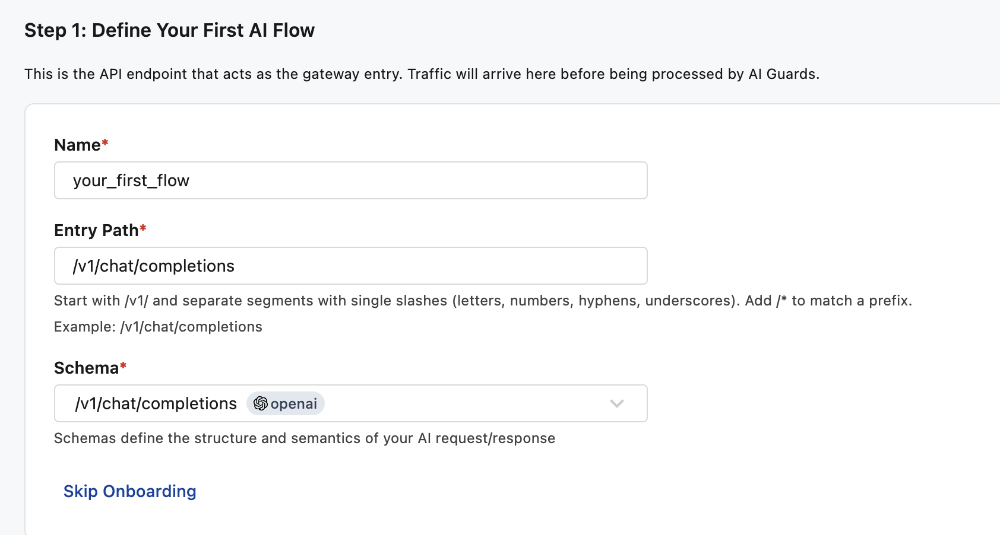
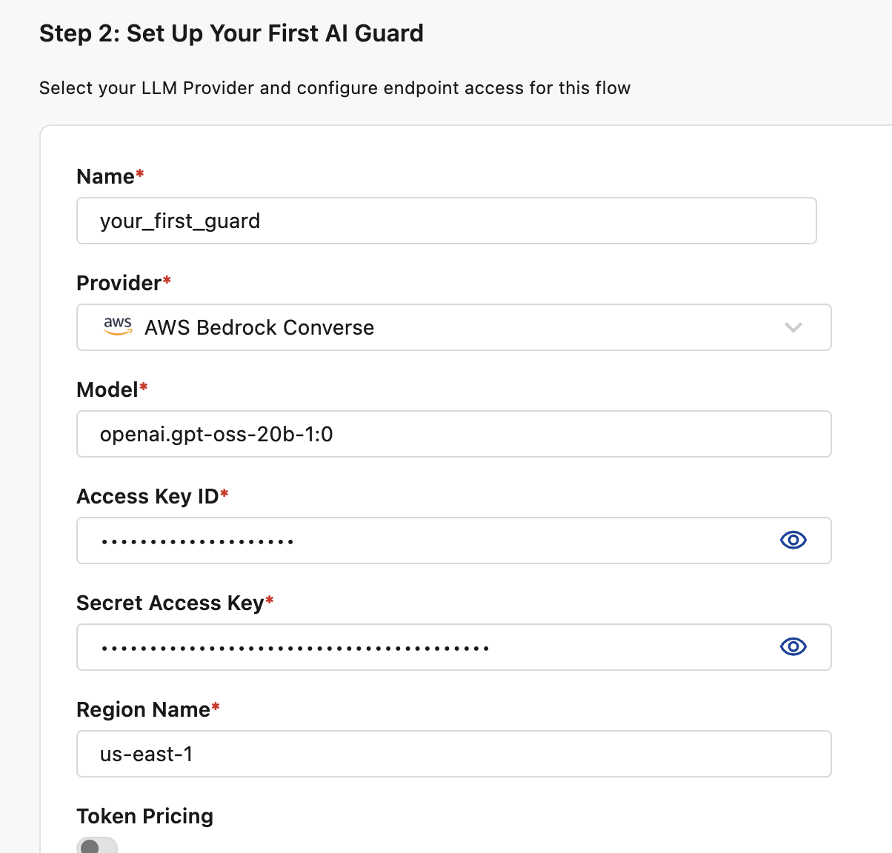
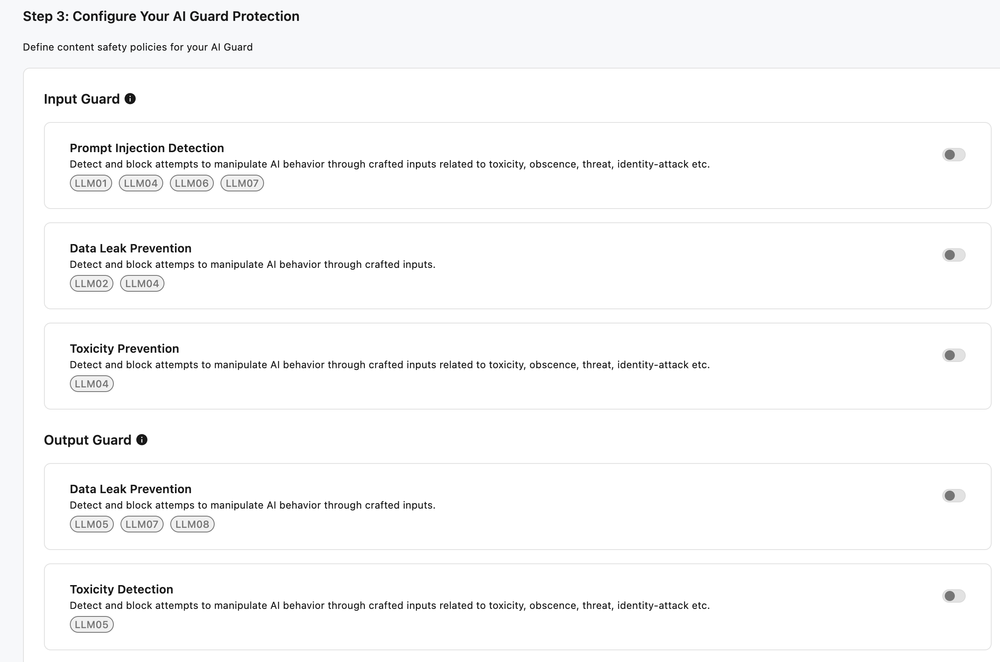
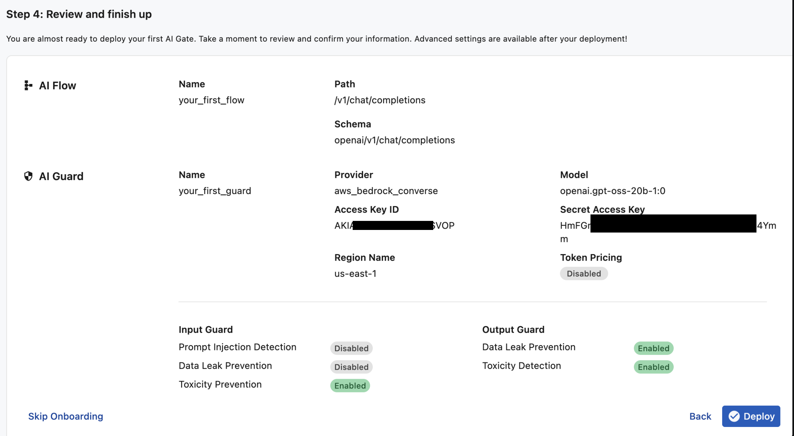
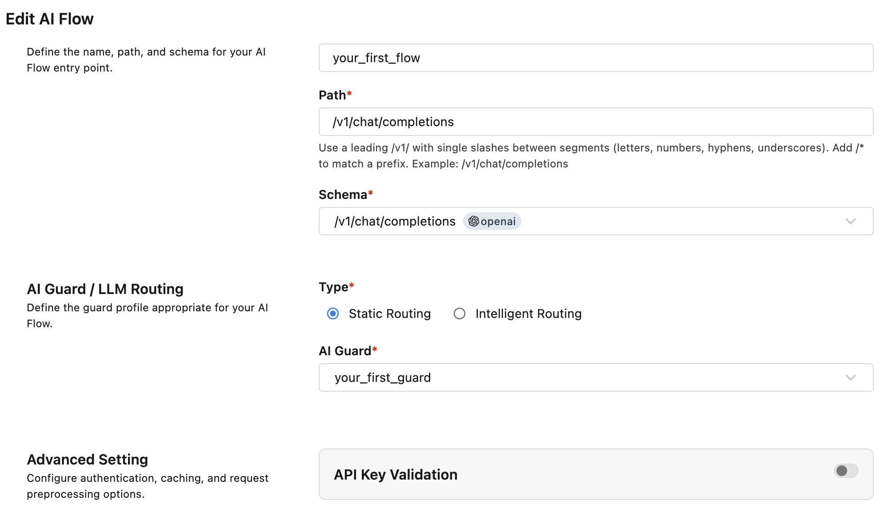

# FortiAIGate Initial Config

This guide covers the first FortiAIGate GUI steps after the Helm deployment is
ready. Use it after `status_fortiaigate.yml` reports `FortiAIGate status: READY`.

## 1. Log In

Open the login URL printed by `status_fortiaigate.yml`.

Default lab credentials:

| Version | Username | Password |
|---|---|---|
| 8.0.0 | `admin` | `fortinet` |
| 8.0.1 | `admin` | blank |

FortiAIGate 8.0.1 serves the UI under `/ui/`. The status and validation
playbooks print the version-aware UI URL when `fortiaigate_ui_path` is set or
derived from `fortiaigate_version`.

Change the default password when prompted.

## 2. Define The AI Flow

Create the initial AI flow that will receive OpenAI-compatible chat requests.



## 3. Define The Guard

Create the Bedrock-backed guard/provider. This step needs the Bedrock access
key, secret access key, permitted region, and model ID from
`terraform/aws-bedrock`.



## 4. Configure Guards

Enable the guard for the flow with the toggle switch.



## 5. Deploy

Review the summary page and deploy the configuration.



## 6. Disable API Key Validation For Lab Testing

Edit the AI flow and disable API key validation for easier first-pass testing.
This is a lab convenience so `test_fortiaigate_chat.yml` can call
`/v1/chat/completions` without a client API key.



After this is complete, run the external chat test:

```bash
cd ansible
ansible-playbook playbooks/test_fortiaigate_chat.yml
```
