# FortiAIGate Initial Config

This guide starts after Helm deployment is complete and
`status_fortiaigate.yml` reports `FortiAIGate status: READY`.

## 1. What You Are Building

The custom Chatbot UI has three user-selectable LLM paths built into its path
selector:

- `Direct LiteLLM`: the chatbot calls LiteLLM directly. FortiAIGate does not
  inspect the request.
- `FAIG Static Route`: the chatbot calls an explicit FortiAIGate URI such as
  `/v1/demo-a/chat/completions`.
- `FAIG Intelligent Route`: the chatbot calls `/v1/intelligent/chat/completions`.
  `passthrough` is the default and sends no route header; `demo-a` and `demo-b`
  send the configured model-route header.

The visual reference is maintained in
[fortiaigate-lab-flows.md](fortiaigate-lab-flows.md).

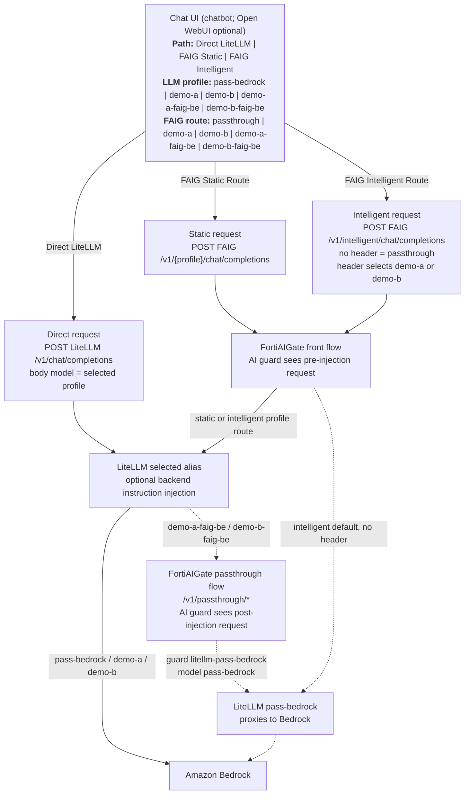

## 2. Collect Inputs And Test LiteLLM First

Before starting the FortiAIGate GUI work, confirm the LiteLLM profiles work.
This catches Bedrock/IAM/LiteLLM issues before you start building GUI flows.

```bash
cd ansible
ansible-playbook playbooks/test_litellm_direct.yml
```

By default this tests:

- `pass-bedrock`
- `demo-a`
- `demo-b`

Override the default list with `litellm_direct_test_models` in
`ansible/group_vars/user.yml` or by passing an extra var.

Collect GUI values with:

```bash
ansible-playbook playbooks/show_demo_outputs.yml
```

The output includes a `LiteLLM proxy provider` block. Use
`API endpoint/private` for the FortiAIGate provider endpoint and `API key` from
that same block when creating FortiAIGate LiteLLM-backed guards/providers.

## 3. Provider Reference

### LiteLLM Provider

Use this for the normal lab flows.

| FortiAIGate input | Value/source |
|---|---|
| Provider type | OpenAI-compatible |
| API endpoint | `API endpoint/private` from the `LiteLLM proxy provider` block in `show_demo_outputs.yml` |
| API key | `API key` from the `LiteLLM proxy provider` block in `show_demo_outputs.yml` |
| Models | `pass-bedrock`, `demo-a`, `demo-b`, `demo-a-faig-be`, `demo-b-faig-be` |

## 4. Creation Order Overview

Create guards/providers before flows. Create explicit flow paths before the
generic `/v1/*` fallback. FortiAIGate appears to evaluate URI rules top-down in
creation order, so an early `/v1/*` fallback can shadow more specific routes.

The full guard table is in [Create All Remaining Guards](#8-create-all-remaining-guards).
The full route table is in [Create All Remaining Flows](#9-create-all-remaining-flows).

## 5. Guard / Provider Values To Create

This section is a quick preview. The creation table is repeated where you need
it in [Create All Remaining Guards](#8-create-all-remaining-guards).

Required guard/provider names:

- `litellm-pass-bedrock`
- `demo-a`
- `demo-b`
- `demo-a-faig-be`
- `demo-b-faig-be`

## 6. Log In

Open the login URL printed by `status_fortiaigate.yml`.

Default lab credentials:

| Version | Username | Password |
|---|---|---|
| 8.0.0 | `admin` | `fortinet` |
| 8.0.1 | `admin` | blank |

FortiAIGate 8.0.1 serves the UI under `/ui/`.

## 7. Create The First Flow With Onboarding

On first login, FortiAIGate offers an onboarding flow. Use onboarding to create
the initial explicit passthrough flow. Do not create `/v1/*` yet; the generic
fallback must be created last.

| Field | Value |
|---|---|
| Flow name | `passthrough` |
| GUI configured path | `/v1/passthrough/*` |
| Guard/provider name | `litellm-pass-bedrock` |
| LiteLLM model | `pass-bedrock` |
| API key validation | onboarding leaves this enabled; disable it manually after onboarding |

This gives a quick success path without risking the fallback rule shadowing
later explicit paths. Onboarding does not expose every setting we need for the
lab, so after onboarding completes, return to the created flow and disable API
key validation manually for easier testing.

Screenshots:

Define the initial passthrough flow and use the explicit `/v1/passthrough/*`
path. Do not create the generic `/v1/*` fallback during onboarding.

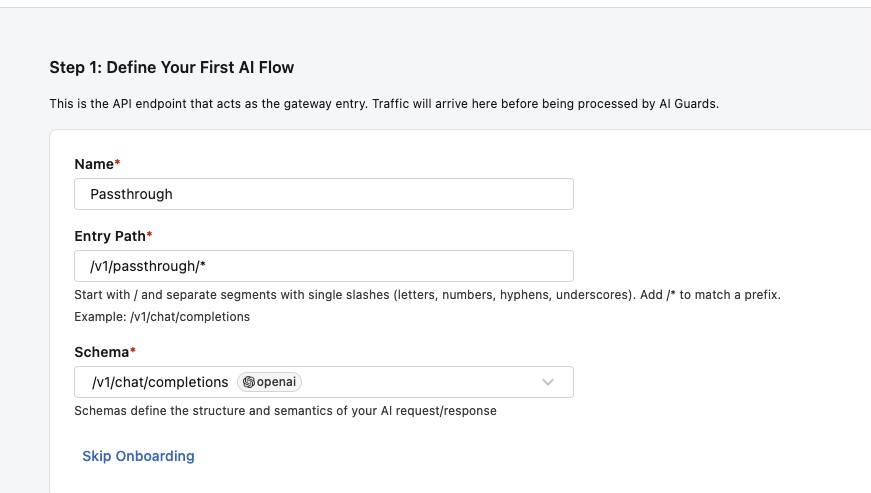

Create the first AI guard with the `API endpoint/private` and `API key` values
from the `LiteLLM proxy provider` block printed by `show_demo_outputs.yml`.

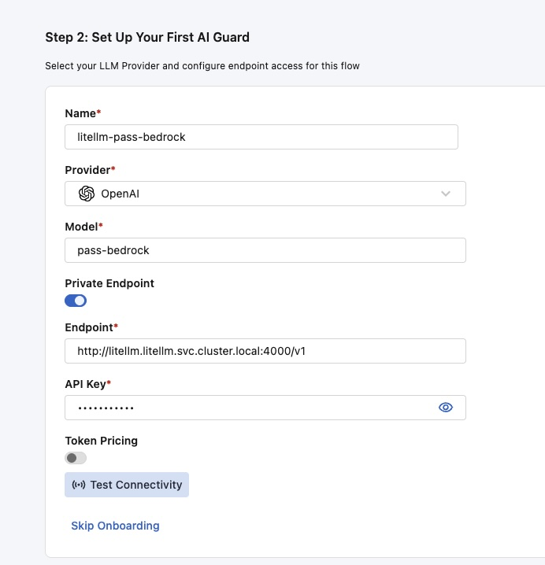

Select which guards apply to the flow. For this first passthrough flow, use the
`litellm-pass-bedrock` guard.

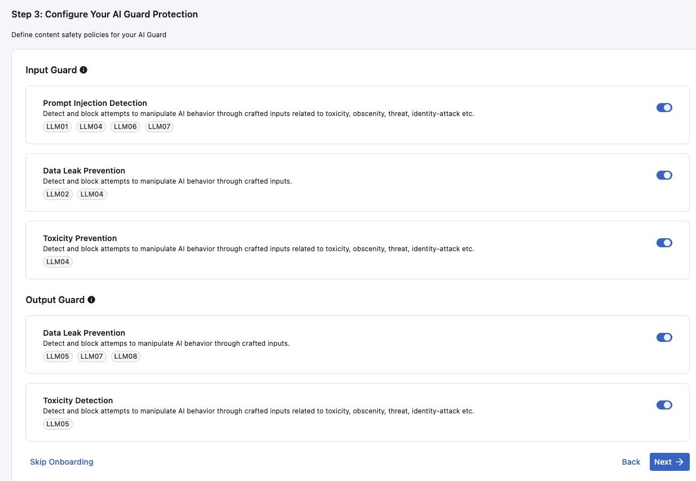

Review the onboarding summary and deploy the first flow.

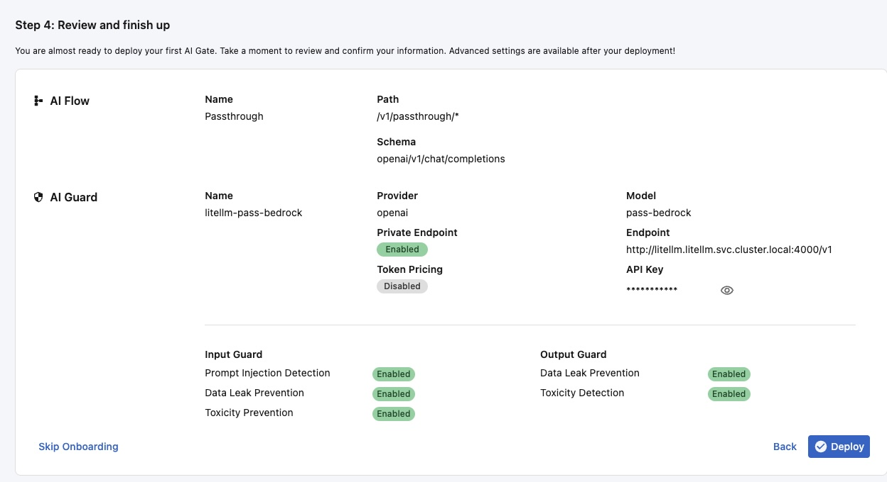

After onboarding deploys the first flow, edit that flow and disable API key
validation for lab testing:

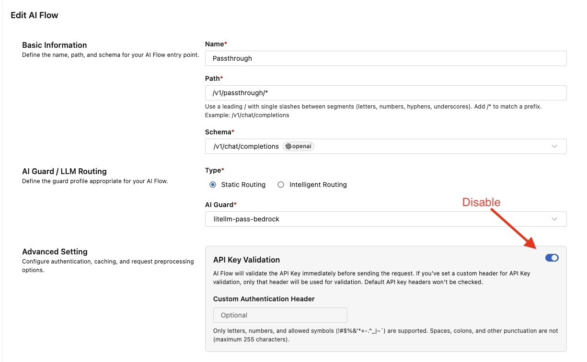

Run:

```bash
ansible-playbook playbooks/test_fortiaigate_chat.yml \
  -e fortiaigate_test_endpoint_path=/v1/passthrough/chat/completions
```

If this first passthrough test times out, run the same command one more time
before troubleshooting. The initial FortiAIGate path can still be warming up
immediately after onboarding and flow deployment.

## 8. Create All Remaining Guards

Create the remaining LiteLLM-backed guards/providers from this table. The
`litellm-pass-bedrock` guard may already exist from onboarding; verify its
endpoint, API key, and model before moving on.

| Guard/provider name | Provider endpoint | Model/profile | Notes |
|---|---|---|---|
| `litellm-pass-bedrock` | `API endpoint/private` from `LiteLLM proxy provider` output | `pass-bedrock` | No instruction injection; use for fallback, passthrough, and the post-injection FAIG re-entry path. This may be created during first-login onboarding. |
| `demo-a` | `API endpoint/private` from `LiteLLM proxy provider` output | `demo-a` | Default demo backend instruction profile |
| `demo-b` | `API endpoint/private` from `LiteLLM proxy provider` output | `demo-b` | Alternate demo backend instruction profile |
| `demo-a-faig-be` | `API endpoint/private` from `LiteLLM proxy provider` output | `demo-a-faig-be` | Injects default instructions, then sends back through FAIG `/v1/passthrough/*` |
| `demo-b-faig-be` | `API endpoint/private` from `LiteLLM proxy provider` output | `demo-b-faig-be` | Injects alternate instructions, then sends back through FAIG `/v1/passthrough/*` |

Use `API key` from the same `LiteLLM proxy provider` output block for each
guard/provider.

Do not configure the `/v1/passthrough/*` route to call a `*-faig-be` model.
That creates a request loop. The route should use the `litellm-pass-bedrock`
guard/provider and LiteLLM model alias `pass-bedrock`.

If the guards are created correctly and in this order, all five guards should
pass the FortiAIGate GUI provider/model test before you start creating the
remaining flows.

Guard/provider screenshots:

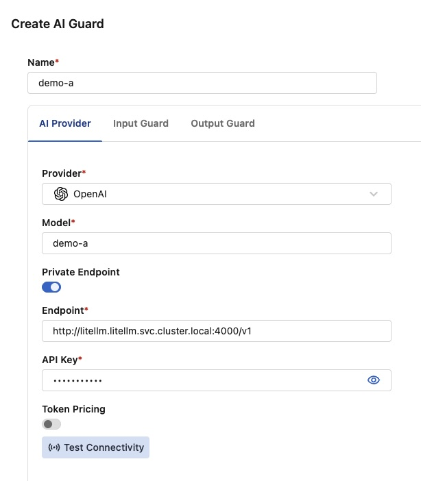


## 9. Create All Remaining Flows

Create the remaining flow URI rules in the order shown below. If you recreate
the fallback `/v1/*` flow, make sure it is last.

| Order | Name | GUI configured path | AI guard | Purpose | Resulting request path, not a GUI field |
|---:|---|---|---|---|---|
| 1 | Passthrough | `/v1/passthrough/*` | `litellm-pass-bedrock` | Explicit passthrough static route. This may be created during first-login onboarding. | `/v1/passthrough/chat/completions` |
| 2 | Demo A | `/v1/demo-a/*` | `demo-a` | Static route with default demo backend instructions | `/v1/demo-a/chat/completions` |
| 3 | Demo B | `/v1/demo-b/*` | `demo-b` | Static route with alternate backend instructions | `/v1/demo-b/chat/completions` |
| 4 | `demo-a_faig-backend` | `/v1/demo-a-faig-be/*` | `demo-a-faig-be` | Static route that chains back through FAIG after LiteLLM injection | `/v1/demo-a-faig-be/chat/completions` |
| 5 | `demo-b_faig-backend` | `/v1/demo-b-faig-be/*` | `demo-b-faig-be` | Alternate post-injection inspection route | `/v1/demo-b-faig-be/chat/completions` |
| 6 | Intelligent routing | `/v1/intelligent/*` | default `litellm-pass-bedrock`; header-selected `demo-a` or `demo-b` | One URI with optional header routing | `/v1/intelligent/chat/completions` |
| 7 | Default fallback, create last | `/v1/*` | `litellm-pass-bedrock` | Generic OpenAI-compatible fallback | `/v1/chat/completions` |

Optional routes:

| Name | GUI configured path | AI guard / model | Resulting request path, not a GUI field |
|---|---|---|---|
| Open WebUI support / experimentation | `/v1/openwebui/*` | Request body model or selected provider/model | `/v1/openwebui/chat/completions` |
| API test | `/v1/test/*` | Test provider/model | `/v1/test/chat/completions` |
| Ollama validation | `/v1/ollama/*` | Ollama provider/model | `/v1/ollama/chat/completions` |

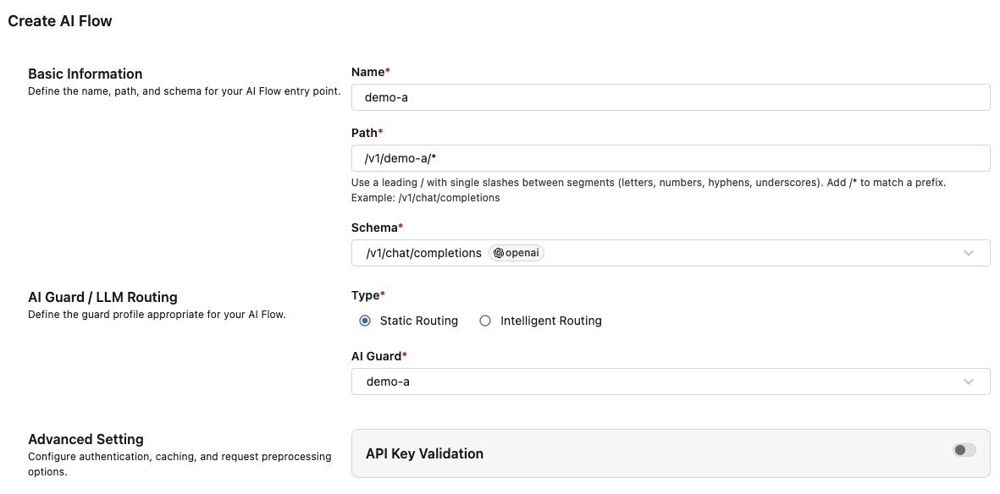

For intelligent routing, create a default route and two header-based routing
rules:

| Routing name | Type | Header name | Operator | Value | AI guard |
|---|---|---|---|---|---|
| `demo-a` | header | `X-FAIG-Model-Route` | `is` | `demo-a` | `demo-a` |
| `demo-b` | header | `X-FAIG-Model-Route` | `is` | `demo-b` | `demo-b` |
| `Default*` | default / no header | none | none | none | `litellm-pass-bedrock` |

The chatbot sends no intelligent-route header for `passthrough`; FortiAIGate
should therefore use the default pass-through guard/provider for that flow.

Intelligent routing screenshots:

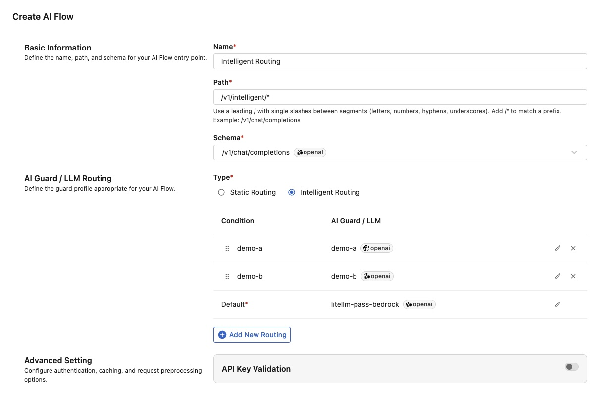

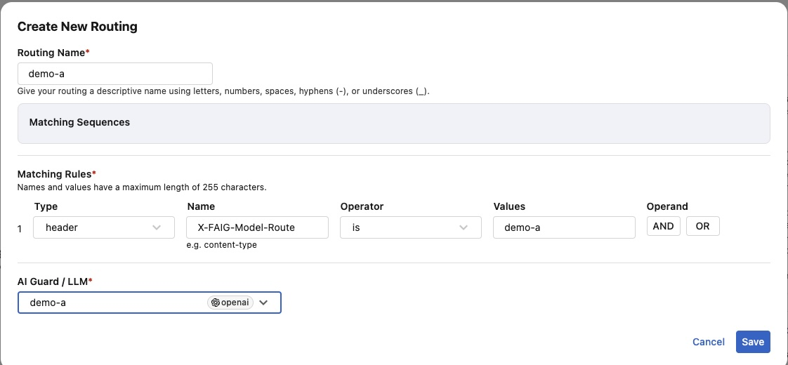

After the final fallback `/v1/*` flow exists, the default test command can use
`/v1/chat/completions`:

```bash
ansible-playbook playbooks/test_fortiaigate_chat.yml
```

## 10. Validate All Routes

Run the default fallback test:

```bash
ansible-playbook playbooks/test_fortiaigate_chat.yml
```

Run the default configured route matrix:

```bash
ansible-playbook playbooks/test_fortiaigate_chat.yml -e poll_all_endpoints=true
```

Expected behavior:

- The default route matrix tests seven endpoints: `passthrough`, `demo-a`,
  `demo-b`, `demo-a-faig-be`, `demo-b-faig-be`, `intelligent`, and `default`.
- The `intelligent` test uses the configured default intelligent route. It does
  not test every possible intelligent-route profile unless
  `fortiaigate_test_include_all_header_route_profiles=true` is set.
- Each endpoint prints the URL, model/profile, question, HTTP status, and answer.
- The final task prints `FortiAIGate endpoint test summary: PASS`.
- The question asks the model to repeat the URI under test, which makes route
  mistakes easier to spot in the output and in FortiAIGate logs.

Optional diagnostic test cases for `/v1/openwebui` can be enabled with
`fortiaigate_test_include_openwebui_endpoint=true`. This is primarily for
support and experimentation; the core lab does not require a dedicated Open
WebUI flow.

## 11. Review FortiAIGate Logs

After the route matrix passes, open the FortiAIGate UI and browse to
**Logs | Log Reports**. Review the requests that just ran. Confirm the tested
URI, selected flow, guard/model, request content, and response content match the
route you expected.

The Ansible `test_fortiaigate_chat.yml` playbook asks each endpoint to repeat
the URI under test. A good log entry should show a prompt similar to:

```text
Hello, I'm testing the /v1/demo-a URI. Please respond back with the same URI
and include the name of the model answering.
```

Use the repeated URI and selected guard/model in the log entry to confirm the
request reached the intended flow.

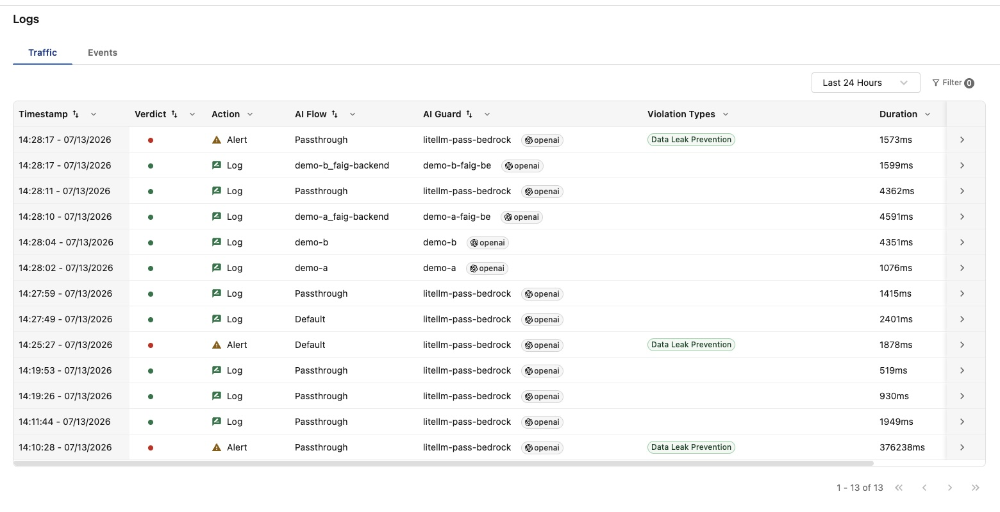

## 12. Troubleshooting

| Symptom | Likely cause | Fix |
|---|---|---|
| `/v1/demo-a/*` still hits fallback | `/v1/*` was created/listed before explicit routes | Recreate or reorder routes so `/v1/*` is last |
| LiteLLM says invalid model | FAIG guard/provider model does not match LiteLLM alias | Use `pass-bedrock`, `demo-a`, `demo-b`, `demo-a-faig-be`, or `demo-b-faig-be` |
| Route matrix fails on intelligent `passthrough` | Intelligent flow requires a header for all routing | Configure no-header/default behavior to pass-through |
| Re-entry route loops | `/v1/passthrough/*` points to a `*-faig-be` model | Point the pass-through route to `litellm-pass-bedrock` / `pass-bedrock` |
| 401/403 from FAIG test | API key validation is still enabled or wrong key/header is used; logs should show an invalid API key/authentication failure | Disable lab API key validation or set `fortiaigate_test_api_key` |

## 13. Reference: Bedrock Direct Provider

The default lab path sends FortiAIGate to LiteLLM, and LiteLLM uses the EC2
instance role to reach Bedrock. Use Bedrock direct configuration only when
testing FortiAIGate calling Bedrock without LiteLLM in the middle.

| FortiAIGate input | Source |
|---|---|
| Region | `terraform -chdir=terraform/aws-prep output bedrock_allowed_regions` |
| LLM model | `terraform -chdir=terraform/aws-prep output bedrock_model_ids` |
| Access key ID | `terraform -chdir=terraform/aws-prep output bedrock_access_key_id` |
| Secret access key | `terraform -chdir=terraform/aws-prep output -raw bedrock_secret_access_key` |

To print the Bedrock secret access key through the Ansible output helper:

```bash
ansible-playbook playbooks/show_demo_outputs.yml -e demo_outputs_show_secrets=true
```

Treat terminal scrollback as sensitive when printing secrets.
