# FortiAIGate Initial Configuration

Use this guide after Deployment Quickstart reports FortiAIGate `READY`. It
uses the FortiAIGate 8.x onboarding wizard to create the smallest usable
configuration: the global `/v1/passthrough/*` flow and a no-protection AI
Guard whose `pass-model` next hop is LiteLLM.

Do not run functional scenario validation yet. First complete this guide,
install the desired scenarios, and create their FortiAIGate objects with
[Scenario GUI Configuration](fortiaigate-gui-config.md). The command
`python3 -m functional_test validate` is the final check after that GUI
configuration is deployed.

All commands run from `<repo_root>`.

## Before Opening The GUI

Select the deployed environment and confirm FortiAIGate and LiteLLM are ready:

```bash
export FAIG_INVENTORY=cloud
# or
export FAIG_INVENTORY=local

ansible-playbook -i "$FAIG_INVENTORY" ansible/playbooks/status_fortiaigate.yml
ansible-playbook -i "$FAIG_INVENTORY" ansible/playbooks/status_litellm.yml
ansible-playbook -i "$FAIG_INVENTORY" ansible/playbooks/test_litellm_direct.yml
ansible-playbook -i "$FAIG_INVENTORY" ansible/playbooks/show_demo_outputs.yml
```

Use the FortiAIGate Admin URL and LiteLLM values printed by Demo Outputs. The
LiteLLM URL and provider credential are shared by every FortiAIGate guard;
flow names, flow paths, guard names, and model aliases vary by scenario.

| Value | Initial passthrough setting |
|---|---|
| LiteLLM endpoint | `{{litellm_url}}`, normally `http://litellm.litellm.svc.cluster.local:4000/v1` |
| LiteLLM API key | `{{litellm_api_key}}`, the ignored `litellm_master_key` value |
| Flow Name | `passthrough` |
| Flow path | `/v1/passthrough/*` |
| Guard Name | `pass_model` |
| Guard Template | `no_protections` |
| Model | `pass-model` |

Never put `{{litellm_api_key}}`, a FortiAIGate API key, passwords, private
addresses, or other environment secrets in screenshots or committed files.

## 1. Log In And Set The Password

Open the Admin URL and complete the FortiAIGate 8.x first-login workflow.
Change the initial password when prompted, store it outside Git, and confirm
that the deployed license is active before starting the onboarding wizard.

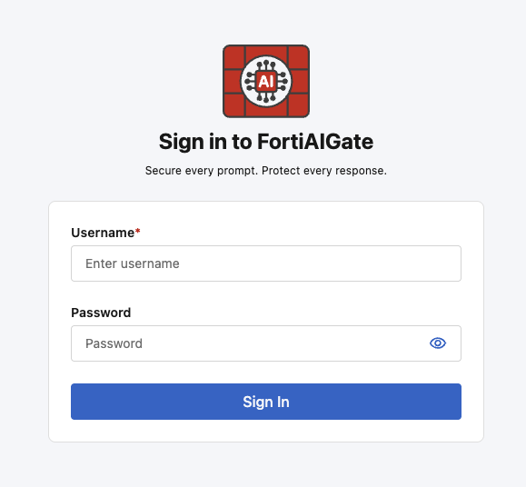

*Sign in to begin the first-login workflow, then set the administrator
password and confirm that the FortiAIGate license is active.*

## 2. Complete The Onboarding Wizard

The onboarding wizard creates the initial flow and its AI Guard together.
LiteLLM is configured on this guard; there is no separate global provider
setup in this workflow.

### 2.1 Define Your First AI Flow

Enter the passthrough flow identity:

| Field | Value |
|---|---|
| Flow Name | `passthrough` |
| Path | `/v1/passthrough/*` |

The wildcard is required. Requests use
`/v1/passthrough/chat/completions`. Do not create a generic `/v1/*` fallback;
it can conceal a missing scenario flow or make path ordering ambiguous.

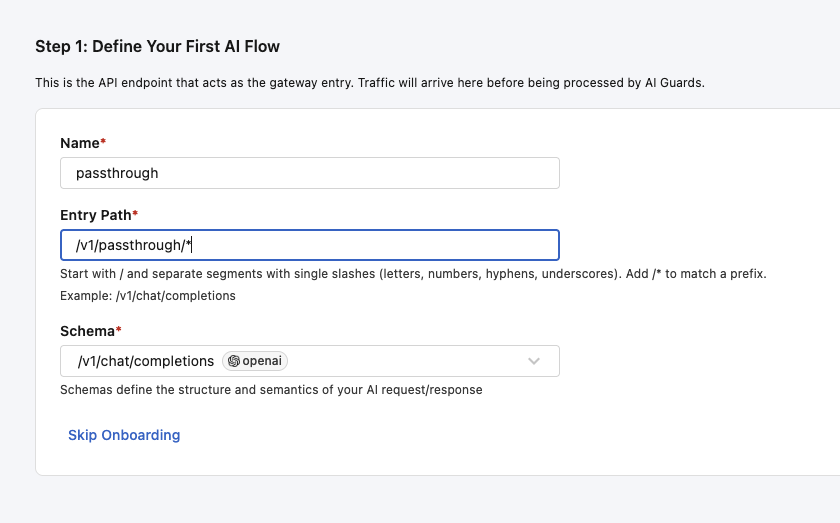

*Define the initial `passthrough` flow at `/v1/passthrough/*`.*

### 2.2 Set Up Your First AI Guard

Configure the passthrough guard with LiteLLM as its private OpenAI-compatible
endpoint:

| Field | Value |
|---|---|
| AI Guard name | `pass_model` |
| Provider | `OpenAI` |
| Model | `pass-model` |
| Private endpoint | Enabled |
| Endpoint | `{{litellm_url}}` |
| API key | `{{litellm_api_key}}` |
| Token pricing | Enabled |
| Input token cost | A non-secret demonstration value |
| Output token cost | A non-secret demonstration value |

Select `OpenAI` as the provider even though LiteLLM is the next hop: LiteLLM
exposes the OpenAI-compatible API used by this guard. Turn on **Private
endpoint** and enter `{{litellm_url}}` in the field labeled **Endpoint**. The
model name must match the LiteLLM alias `pass-model` exactly.

Token costs are used only for FortiAIGate GUI cost calculations in this lab.
They do not represent actual local-model or cloud billing, so synthetic input
and output prices are acceptable. Use the same demonstration pricing policy
for later scenario guards so dashboard comparisons remain understandable.

The API key authenticates FortiAIGate to LiteLLM. It is separate from optional
client authentication on a FortiAIGate flow.

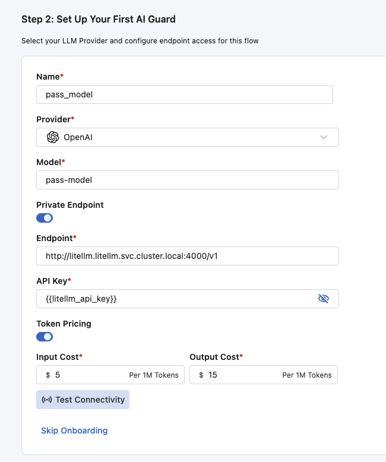

*Configure `pass_model` with the OpenAI provider, `pass-model`, the private
LiteLLM endpoint, and demonstration token costs.*

Before continuing, click **Test Model**. This generic connectivity check should
be repeated for every guard created later. It verifies only the API key, model
alias, Endpoint, and connectivity from FortiAIGate to LiteLLM; it does not
exercise any Alert, Deny, or Redact protection.

Use a simple prompt such as `Reply with only: ok passthrough validation`. If
the test fails, compare the provider, Private endpoint switch, Endpoint, API
key, and model alias with the table above. Correct the guard and test again
until it succeeds.

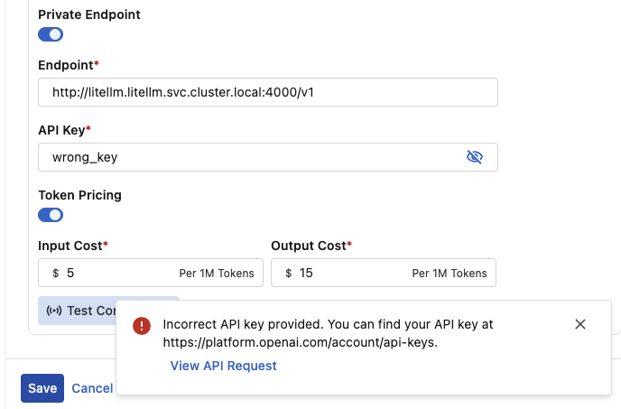

*A failed Test Model result identifies a guard-to-LiteLLM configuration
problem before flow validation.*

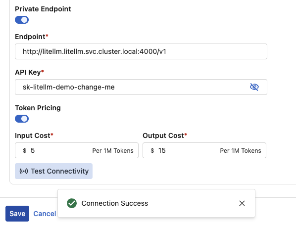

*Confirm that `pass_model` reaches the LiteLLM `pass-model` alias
successfully.*

### 2.3 Configure Your AI Guard Protection

Leave every protection switch off. This guard provides a full FortiAIGate
traversal control without prompt-injection, DLP, deny, or redaction behavior.
It also avoids scenario-specific LiteLLM instructions because `pass-model` is
the next-hop alias. The generated work order calls this guard template
`no_protections`.

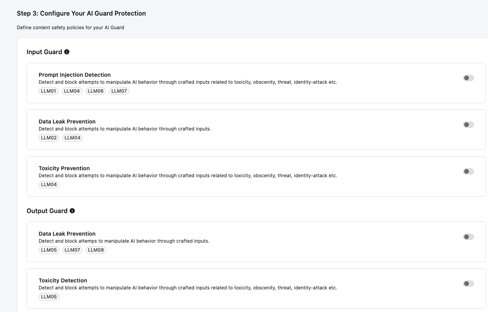

*Leave all protection features disabled for the passthrough guard.*

### 2.4 Review And Finish

Review the flow, guard, endpoint, model, and disabled protections, then click
**Deploy**. Wait for deployment to report success before editing or testing
the new objects.

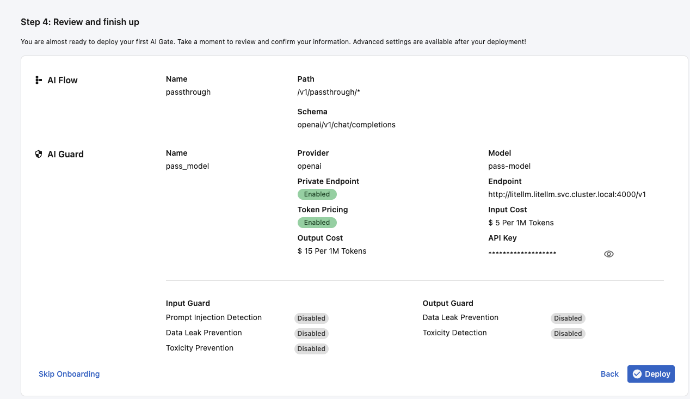

*Review and deploy the initial passthrough flow and `pass_model` guard.*

## 3. Correct The Wizard Flow Authentication

Edit the wizard-created `passthrough` flow and remove or disable its client
authentication requirement. Most lab flows disable client-to-FortiAIGate API
key validation so testing focuses on AI protections. This does not disable the
separate LiteLLM API key configured on the guard.

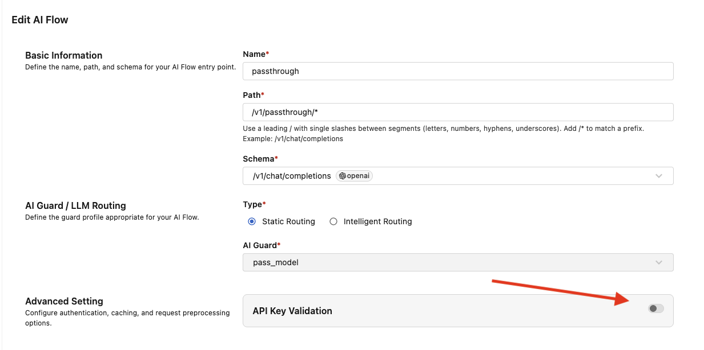

*Edit the wizard-created passthrough flow and disable client authentication
for the isolated lab baseline.*

Deploy the flow change before testing the request path.

## 4. Validate Passthrough

After flow authentication is disabled and **Test Model** succeeds, run the
controller-side test against the exact flow:

```bash
ansible-playbook -i "$FAIG_INVENTORY" \
  ansible/playbooks/test_fortiaigate_chat.yml \
  -e fortiaigate_test_endpoint_path=/v1/passthrough/chat/completions \
  -e fortiaigate_test_model=pass-model
```

Expected result:

- HTTP success;
- response from `pass-model`;
- flow `passthrough` and guard `pass_model` in FortiAIGate telemetry;
- no scenario instruction marker; and
- no prompt-injection, DLP, deny, or redaction action.

If it fails, use
[FortiAIGate Returns 401, 404, Or The Wrong Guard](troubleshooting.md#fortiaigate-returns-401-404-or-the-wrong-guard).

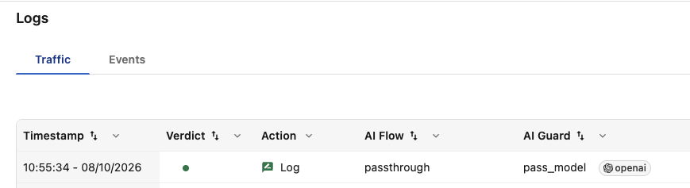

*Confirm that the passthrough request reached `pass-model` without scenario
protection.*

## Optional: Configure Syslog

The repository's Fluent Bit collector is an optional stop-gap when
FortiAnalyzer is unavailable. First print the deployed destination:

```bash
ansible-playbook -i "$FAIG_INVENTORY" \
  ansible/playbooks/show_demo_outputs.yml
ansible-playbook -i "$FAIG_INVENTORY" \
  ansible/playbooks/status_fortiaigate_syslog_collector.yml
```

Use the **FAIG Syslog target/IP** value. Current FortiAIGate builds require the
printed ClusterIP rather than the service DNS name.

For AWS, durable syslog storage is enabled only by the Terraform variable in
ignored `terraform/aws-prep/99-local.auto.tfvars`:

```hcl
fortiaigate_syslog_bucket_enabled = true
```

This is an AWS Prep module setting, not a shared `terraform/user.tfvars`
setting. Do not add it to `50-user.auto.tfvars`, which is a link to the shared
file loaded by every module. If the bucket was disabled during the first run,
set the AWS Prep override and rerun quickstart; Terraform and Ansible will
bring the existing deployment to the newly requested state. See
[FortiAIGate Syslog Preservation](troubleshooting/fortiaigate-syslog-preservation.md)
for AWS and local collector details.

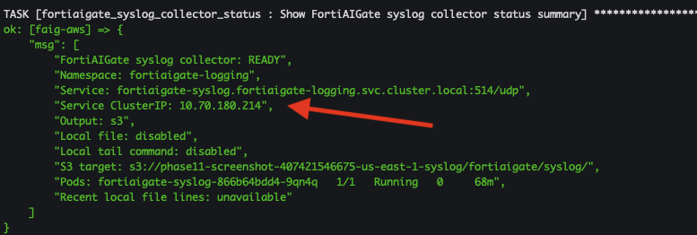

*Read the deployed FortiAIGate syslog destination from Demo Outputs or
collector status.*

In FortiAIGate, navigate to **Logs > Log Settings** and create or enable a
syslog destination using the printed values:

| Field | Value |
|---|---|
| Server | Printed syslog target IP |
| Port | `514` |
| Protocol | `UDP` |
| Status | Enabled |

Save the settings, generate a synthetic passthrough event, and use the status
playbook to confirm that the collector received it.

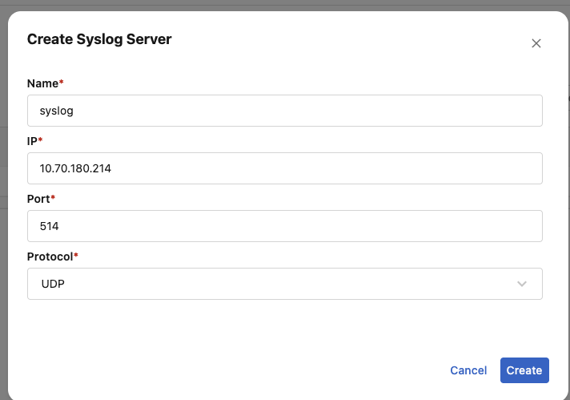

*Configure FortiAIGate to send logs by UDP/514 to the deployed syslog
collector.*

## Next Step

Install scenarios, render their work order, and continue with
[Scenario GUI Configuration](fortiaigate-gui-config.md). After all desired
scenario flows are created, run `python3 -m functional_test validate` from
`<repo_root>`.

The global passthrough flow is reused by Detailed chatbot testing and by any
explicitly enabled, loop-safe FortiAIGate re-entry chain.
