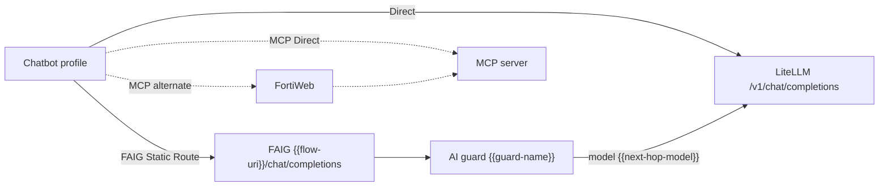

# FortiAIGate Scenario Flow Configuration

Use this guide after Helm deployment reports `FortiAIGate status: READY` and
the baseline scenarios have been installed. Phase 11 uses scenario-owned flow
URIs and LiteLLM aliases; it does not require `demo-a`/`demo-b` routes.

## Generate The Work Order

From the repo root:

```bash
python3 scripts/scenario_profiles.py list-installed
python3 scripts/scenario_profiles.py render-work-order
python3 scripts/build_scenario_matrix.py --output /tmp/scenario-matrix.json
```

The ignored work order is written under
`docs/raw-output/scenario-work-orders/`. It is the installation-specific source
for flow URIs, suggested names, guard templates, and next-hop LiteLLM aliases.
Tracked scenario runbooks explain the test story; they do not override locally
tuned installed profiles.

Validate LiteLLM before configuring FortiAIGate:

```bash
ansible-playbook ansible/playbooks/test_litellm_direct.yml
```

The canonical aliases are:

- `pass-model`: full custom-instruction bypass.
- `<scenario-id>`: the scenario backend instructions, for example
  `fortistore-injection` or `hr-tool-dlp`.

## Screenshot Variables

The walkthrough uses these tokens so one set of screenshots can apply to every
scenario:

| Token | Work-order value |
|---|---|
| `{{scenario-id}}` | Installed scenario ID |
| `{{path-role}}` | Semantic role such as `detect` or `output-dlp-redact` |
| `{{flow-name}}` | Suggested flow name |
| `{{flow-uri}}` | Generated request prefix, without wildcard or OpenAI suffix |
| `{{configured-uri}}` | Exact FAIG value: `{{flow-uri}}/*` |
| `{{guard-name}}` | Suggested AI guard name |
| `{{guard-template}}` | Required behavior template |
| `{{next-hop-model}}` | LiteLLM alias selected by the guard |
| `{{litellm-endpoint}}` | Private LiteLLM OpenAI-compatible endpoint |
| `{{litellm-api-key}}` | LiteLLM API key from ignored deployment output |

Existing screenshots below identify the relevant GUI pages. Some contain old
example values; ignore those values and use the token mapping and generated
work order. Tokenized Phase 11 screenshots can replace them without changing
the scenario runbooks.

## Request Paths


```mermaid
flowchart LR
    UI["Chatbot profile"] -->|"Direct"| LL["LiteLLM /v1/chat/completions"]
    UI -->|"FAIG Static Route"| FLOW["FAIG {{flow-uri}}/chat/completions"]
    FLOW --> GUARD["AI guard {{guard-name}}"]
    GUARD -->|"model {{next-hop-model}}"| LL
    UI -.->|"MCP Direct"| MCP["MCP server"]
    UI -.->|"MCP alternate"| FW["FortiWeb"]
    FW -.-> MCP
```

The LLM path and MCP path are independent. FortiWeb is an advanced MCP
alternate only when its proxy is desired and an installed endpoint exists.
FortiGate LLM routes remain disabled while that path is under development.

## Create Canonical Passthrough

Create this global control first:

| Field | Value |
|---|---|
| Flow name | `passthrough` |
| Configured URI | `/v1/passthrough/*` |
| Guard/provider name | `pass_model` (suggested) |
| Provider type | OpenAI-compatible |
| Provider endpoint | `{{litellm-endpoint}}` |
| Provider model | `pass-model` |
| Provider API key | `{{litellm-api-key}}` |
| API-key validation | Disable for the isolated demo lab if required by the current test workflow |

Do not inject instructions in this guard and do not point it to a scenario
alias. `/v1/passthrough` is the full bypass control.

The onboarding screenshots show the page sequence:

1. Define the explicit URI. Do not create a generic `/v1/*` fallback first.
   [Flow page](images/onboard-step1.jpg)
2. Create the OpenAI-compatible provider with the LiteLLM endpoint and key.
   [Guard/provider page](images/onboard-step2.jpg)
3. Attach the guard to the flow. [Guard selection](images/onboard-step3.jpg)
4. Review and deploy. [Deployment review](images/onboard-step4.jpg)
5. If appropriate for the isolated lab, disable flow API-key validation.
   [Flow API-key setting](images/edit-flow-apienabled.jpg)

Validate it:

```bash
python3 scripts/traffic_generator.py \
  --mode path_test \
  --path-test-path passthrough
```

## Create A Scenario Guard

For each work-order row, create or clone one AI guard:

| Field | Value |
|---|---|
| Guard name | `{{guard-name}}` |
| Provider type | OpenAI-compatible |
| Provider endpoint | `{{litellm-endpoint}}` |
| Provider model | `{{next-hop-model}}` |
| Provider API key | `{{litellm-api-key}}` |
| Input/output protection | Configure from `{{guard-template}}` below |

The provider model must equal the scenario alias in the work order. Different
roles for one scenario intentionally share the same next-hop model so the
comparison changes FAIG policy, not backend instructions.

[Create guard page](images/create-demo-guard.jpg)

### Guard Templates

| Template | Required behavior |
|---|---|
| `detect_only` | Enable the scenario-relevant detectors, log findings, allow the request and response, and do not redact content. |
| `protect_input` | Enable prompt-injection inspection on input and deny/stop explicit instruction-control attacks before generation. |
| `input_dlp` | Enable DLP on model input for comparison; do not describe it as output protection. |
| `output_dlp_deny` | Enable output DLP and deny the response when protected data is detected. |
| `output_dlp_redact` | Enable output DLP and redact detected protected values while allowing the remaining response. |

Scenario runbooks list detector and PII tuning that is specific to the demo.
The input and output pages are shown here:

- [Input protection page](<images/input guard.jpg>)
- [Output protection page](<images/output guard.jpg>)

## Create A Scenario Flow

Create the flow after its guard:

| Field | Value |
|---|---|
| Flow name | `{{flow-name}}` |
| Configured URI | `{{configured-uri}}` |
| Attached guard | `{{guard-name}}` |
| Resulting request URL | `{{flow-uri}}/chat/completions` |

[Create flow page](images/create-demo-flow.jpg)

Specific routes should be created before any generic `/v1/*` fallback because
URI evaluation may be order-sensitive. Phase 11 does not generate intelligent
header routes or FAIG re-entry chains by default.

## Validate Scenario Paths

Test one role through the chatbot-owned agent loop:

```bash
python3 scripts/scenario_test_harness.py \
  --scenario {{scenario-id}} \
  --path-role {{path-role}}
```

Test raw FAIG path connectivity:

```bash
python3 scripts/traffic_generator.py \
  --mode path_test \
  --path-test-path {{flow-name}}
```

Capture the chatbot selection, response, MCP trace when applicable, and FAIG
traffic log fields including flow, guard, action, verdict, model, and timestamp.
[Traffic log page](images/traffic-log-validation.jpg)

## Updates And Removal

Tracked examples are read-only templates. Local scenario files are ignored and
operator-owned. Pulling repo changes never overwrites them.

```bash
python3 scripts/scenario_profiles.py update {{scenario-id}}
python3 scripts/scenario_profiles.py update {{scenario-id}} --force
```

`--force` creates an ignored backup before replacement. Redeploy LiteLLM and
the chatbot after an installed scenario changes. Re-render the work order and
manually update FAIG objects.

Removing a scenario archives its local files and records its FAIG objects as
stale; it does not delete GUI state:

```bash
python3 scripts/scenario_profiles.py remove {{scenario-id}}
python3 scripts/scenario_profiles.py render-work-order
python3 scripts/scenario_profiles.py ack-stale {{scenario-id}}
```

Run `ack-stale` only after the listed flows and guards have been removed from
FortiAIGate.
