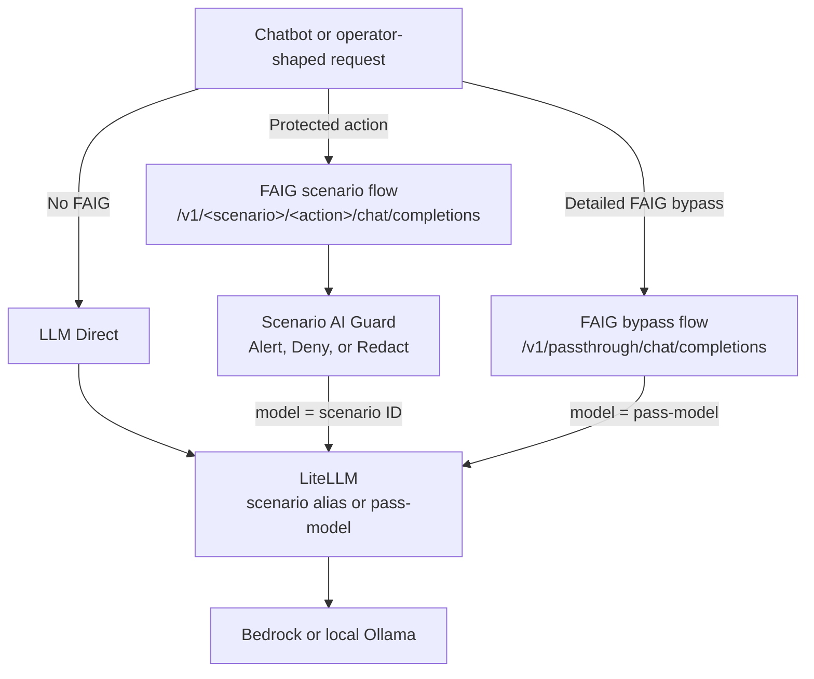
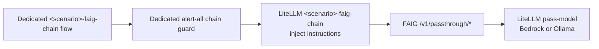
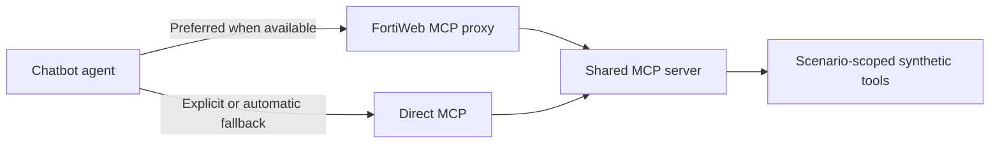

# Architecture

The AWS and local deployment lanes converge on the same single-node k3s
application layer. Their main difference is how infrastructure and the model
provider are supplied.

| Lane | Infrastructure | Default model provider |
|---|---|---|
| AWS | Terraform-created EC2 GPU host, networking, AWS prep resources, and desired FortiGate/FortiWeb appliances | Amazon Bedrock through LiteLLM |
| Local | Existing Ubuntu 24.04 GPU host plus environment-owned inventory generated by `scripts/local_setup.py` | Ollama in k3s through LiteLLM |

## Deployment Topology

```text
Operator workstation
  |-- AWS: Terraform creates infrastructure
  |-- Local: local_setup.py describes existing infrastructure
  `-- Ansible
       |-- configures the GPU host and single-node k3s
       |-- deploys FortiAIGate and the application layer
       `-- configures FortiGate/FortiWeb when desired and available

k3s
  |-- FortiAIGate
  |-- LiteLLM -> Bedrock (AWS) or Ollama (local)
  |-- custom chatbot
  |-- deterministic MCP demo tools
  |-- Demo Home
  |-- FortiAIGate syslog collector when configured
  |-- HTTPS gateway
  `-- Open WebUI when enabled
```

FortiGate and FortiWeb are optional appliances but are desired by default.
The quickstart can explicitly disable either appliance and safely skips one
when its license, inventory, or other prerequisites are missing. Appliance
absence must not break the core k3s deployment.

LiteLLM is the common model-proxy layer for both deployment lanes. It maps
scenario aliases to the selected Bedrock or Ollama model, injects the installed
scenario's backend instructions, and then proxies the request to that provider.
This also gives FAIG guards one consistent OpenAI-compatible downstream
endpoint and authentication pattern instead of requiring separate Bedrock or
Ollama authentication configuration for each guard.

## Model Request Paths

The custom chatbot presents named profiles generated from installed scenario
metadata. A profile combines the model path, optional frontend instructions,
MCP tool selection, and the scenario action.



The passthrough path is a full bypass of project-added instruction profiles and
exists for testing. In the Detailed UI it is always available. In the
Simplified UI it is available when no scenarios are installed.

Scenario guard names follow `<scenario>_<action>`. Current action names are
`alert`, `deny`, and, for DLP scenarios, `redact`.

Canonical scenario configuration uses:

- path `/v1/<scenario>/<action>/*`;
- request URL `/v1/<scenario>/<action>/chat/completions`;
- flow name `<scenario>-<action>`;
- guard name `<scenario>_<action>`; and
- next-hop LiteLLM model `<scenario>`.

Render the exact values for the installed scenarios from the repository root:

```bash
python3 scripts/scenario_profiles.py render-work-order
```

## Optional FAIG Re-entry Chain

The deployment includes a globally available re-entry capability so a user can
show FAIG the instructions that LiteLLM added and inspect the resulting request.
It also provides routing flexibility for future demonstrations where a request
must pass through FortiAIGate both before and after LiteLLM processing:



The downstream re-entry always uses `pass-model`; pointing it back to a chain
alias would create a loop. Every tracked baseline scenario disables this
capability in its own metadata. Operators may opt in only through a local
installed scenario package.

## MCP Tool Paths

The chatbot can call deterministic MCP tools directly or through FortiWeb:



FortiWeb MCP is preferred when the appliance is installed, desired, and has a
usable generated endpoint. If any condition is missing, matrix generation
selects Direct MCP and reports a warning. The selected transport belongs to
the scenario, while Detailed mode can select the scenario tool set or an
explicitly broader installed-tool set for cross-domain demonstrations.

The MCP server uses simulated or synthetic data for repeatable demo behavior.
Scenario instructions and fixtures are written to support clear security
demonstrations while remaining as realistic as practical. They do not imply
access to real business records, uploaded files, or cloud accounts.

## Optional Appliance Boundaries

- FortiWeb's supported baseline role is the MCP reverse-proxy transport.
- FortiGate baseline deployment and configuration are supported, including
  read-only MCP tool schemas when credentials are available.
- Chatbot-to-FortiGate LLM traffic paths are deferred and disabled by default.
- FortiGate LLM paths and appliance-fronted FAIG paths are not required by the
  v1.0 scenario baseline.

## Network Exposure

AWS no-DNS labs use generated public NodePorts for the demo UIs and APIs.
Local labs use the k3s host's trusted-LAN address and the same NodePort
contract. The HTTPS gateway terminates a self-signed certificate while
internal cluster traffic remains HTTP.

Do not expose local NodePorts, especially the Ollama endpoint, to untrusted
networks. Detailed ports and support states are in the
[Current Baseline](reference/current-baseline.md). For the AWS network model,
see [AWS k3s Foundation](aws-k3s-foundation.md).

Installed local scenario metadata owns the active matrix, and the generated
work order owns the exact FAIG paths, guards, templates, and aliases. Tracked
scenario examples remain read-only sources. Run
[Functional Validation](functional-validation.md) after the GUI objects exist
to prove the deployed chatbot, MCP, and FAIG behavior.
