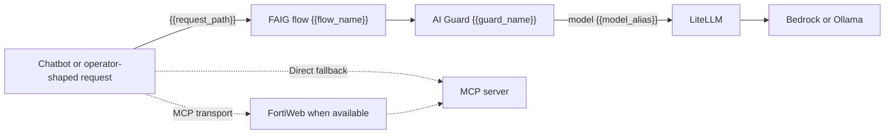

# FortiAIGate Scenario GUI Configuration

This guide turns an installed scenario's generated work order into reusable
FortiAIGate 8.x GUI objects. Complete
[FortiAIGate Initial Configuration](FortiAIGate-initial-config.MD) first so the
LiteLLM provider and global passthrough flow already work.

The generated work order is authoritative for names, paths, model aliases, and
guard templates. Screenshots use `{{variable}}` values so the same walkthrough
applies to every scenario.

All commands run from `<repo_root>`.

Select the deployed environment in each new shell:

```bash
export FAIG_INVENTORY=cloud
export FAIG_HOST_ALIAS=faig-aws
# or
export FAIG_INVENTORY=local
export FAIG_HOST_ALIAS=jarvis
```

For local mode, replace `jarvis` with the host alias selected during
`local_setup.py` when it differs.

## 1. Generate And Read The Work Order

Confirm the scenarios installed in editable local state and render the current
work order:

```bash
python3 scripts/scenario_profiles.py list-installed
python3 scripts/scenario_profiles.py render-work-order
```

The command writes an ignored Markdown file under
`docs/raw-output/scenario-work-orders/` and prints its path. Re-render it after
installing, updating, removing, or locally tuning a scenario.

Map one row at a time:

| Guide variable | Work-order column or value | Example shape |
|---|---|---|
| `{{scenario_id}}` | Scenario | `resume-tool-injection` |
| `{{action}}` | Action, converted to lowercase where needed | `alert`, `deny`, or `redact` |
| `{{flow_name}}` | Suggested flow | `{{scenario_id}}-{{action}}` |
| `{{scenario_path}}` | Configured URI | `/v1/{{scenario_id}}/{{action}}/*` |
| `{{request_path}}` | Configured URI with wildcard replaced | `/v1/{{scenario_id}}/{{action}}/chat/completions` |
| `{{guard_name}}` | Suggested guard | `{{scenario_id}}_{{action}}` |
| `{{guard_template}}` | Guard template | `detect_only`, `protect_input`, `output_dlp_deny`, or `output_dlp_redact` |
| `{{model_alias}}` | Next-hop model | Normally `{{scenario_id}}` |
| `{{expected_behavior}}` | Expected behavior | Work-order description |
| `{{faig_chain_enabled}}` | Optional-chain state | `false` for every built-in scenario |

Guard and flow display names can be changed locally, but the configured URI
and next-hop model alias must match the work order. Keeping the suggested names
makes troubleshooting and telemetry correlation substantially easier.

> **Screenshot placeholder — `faig-scenario-work-order-map`**
>
> Expected filename: `images/fortiaigate/faig-scenario-work-order-map.png`
>
> Caption: Map `{{scenario_id}}`, `{{action}}`, `{{scenario_path}}`, `{{guard_name}}`, and `{{model_alias}}` into FortiAIGate objects.
>
> Capture: A tightly cropped rendered work-order row or terminal view using literal synthetic `{{variable}}` values. Include the guard template and expected behavior; exclude local paths, warnings containing addresses, and unrelated scenarios.

## Request-Path Model



The LLM path and MCP transport are independent. FortiWeb is the preferred MCP
transport when installed, configured, and desired; Direct MCP is the fallback.
Neither transport changes which FAIG flow protects the LLM request or which
scenario tool profile is exposed.

For multi-round MCP scenarios, tool results return to the chatbot as `tool`
messages and are included in the next LLM request. A prompt-injection Deny
guard must inspect those tool-role messages to stop a poisoned document before
the model selects another tool.

## 2. Reuse The LiteLLM Provider

Use the `litellm` OpenAI-compatible provider created during initial
configuration. Confirm the scenario model alias is visible before building the
guard:

```bash
ansible-playbook -i "$FAIG_INVENTORY" ansible/playbooks/test_litellm_direct.yml
```

Create or select `{{model_alias}}` under that provider. For normal scenario
paths it equals `{{scenario_id}}`; do not substitute the underlying Bedrock or
Ollama model ID. LiteLLM owns that final mapping and instruction injection.

## 3. Create The Scenario Guard

Create one guard for each work-order row:

| Field | Value |
|---|---|
| Guard name | `{{guard_name}}` |
| Provider | `litellm` |
| Model | `{{model_alias}}` |
| Protection behavior | `{{guard_template}}` |

Different actions for the same scenario normally share the same model alias.
The guard policy—not a different backend instruction set—creates the Alert,
Deny, or Redact comparison.

> **Screenshot placeholder — `faig-scenario-guard-base`**
>
> Expected filename: `images/fortiaigate/faig-scenario-guard-base.png`
>
> Caption: Create `{{guard_name}}` and select `{{model_alias}}` as its next hop.
>
> Capture: The guard identity/provider page with literal `{{guard_name}}` and `{{model_alias}}` values where free-text fields permit them. Keep the LiteLLM key masked.

### `detect_only`: Alert Without Enforcement

Enable the scenario-relevant prompt-injection or sensitive-data detector,
enable logging/telemetry, and allow the request and response. Do not select
deny, block, or redact. The matching work-order behavior should say the attack
continues while FortiAIGate records the detection.

> **Screenshot placeholder — `faig-scenario-alert-protection`**
>
> Expected filename: `images/fortiaigate/faig-scenario-alert-protection.png`
>
> Caption: Configure `{{guard_name}}` with `{{guard_template}}` to detect and alert without denying.
>
> Capture: The relevant protection page with detection and logging enabled and enforcement disabled. Show the action summary; avoid scenario-specific tuning that will require a different shared screenshot.

### `protect_input`: Deny Prompt Injection

Enable prompt-injection inspection for the complete input transcript and set
the action to deny/block. For tool scenarios, confirm inspection includes
retrieved document content carried in `tool` messages. The goal is to stop the
poisoned content before the model can follow it or select a prohibited tool.

> **Screenshot placeholder — `faig-scenario-deny-protection`**
>
> Expected filename: `images/fortiaigate/faig-scenario-deny-protection.png`
>
> Caption: Configure `{{guard_name}}` to deny the protected prompt or tool response.
>
> Capture: The input prompt-injection protection page showing full-transcript/tool-message inspection when the GUI exposes it and the deny/block action selected.

### `output_dlp_deny`: Deny Sensitive Output

Enable the scenario's required output DLP patterns and set the output action to
deny. The active HR demonstration uses synthetic date-of-birth and payment-card
patterns. Scenario documentation supplies the exact tuning; this shared guide
does not invent additional protected fields.

> **Screenshot placeholder — `faig-scenario-output-dlp-deny`**
>
> Expected filename: `images/fortiaigate/faig-scenario-output-dlp-deny.png`
>
> Caption: Configure output DLP to deny responses containing the selected sensitive-data patterns.
>
> Capture: The output DLP page with representative synthetic DOB/payment-card detectors and the deny action visible. Do not include real personal data in test fields.

### `output_dlp_redact`: Redact Sensitive Output

Use the same scenario-required patterns, but select redaction so the safe
remainder of the response is returned. Do not treat input-DLP or the future
`redact-dummy` behavior as part of this output-redaction path.

> **Screenshot placeholder — `faig-scenario-output-dlp-redact`**
>
> Expected filename: `images/fortiaigate/faig-scenario-output-dlp-redact.png`
>
> Caption: Configure output DLP to redact the selected sensitive-data patterns.
>
> Capture: The output DLP page using the same representative patterns as Deny, with redact selected and the replacement behavior visible if configurable.

## 4. Test The Guard In The GUI

Before creating the flow, use FortiAIGate's built-in AI Guard test. Use the
exact scenario prompt from its metadata. For document/tool injection, use the
preconstructed synthetic transcript only to test guard inspection; it does not
prove a live MCP call occurred.

Expected results:

| Template | GUI test result |
|---|---|
| `detect_only` | Detection recorded; request/response allowed |
| `protect_input` | Injection detected; input denied or blocked |
| `output_dlp_deny` | Protected output detected; response denied |
| `output_dlp_redact` | Protected output detected; matching values redacted |

> **Screenshot placeholder — `faig-scenario-guard-test`**
>
> Expected filename: `images/fortiaigate/faig-scenario-guard-test.png`
>
> Caption: Test `{{guard_name}}` with the scenario fixture and confirm the expected `{{action}}` result.
>
> Capture: The AI Guard test result with detector, action, and disposition visible. Use only synthetic prompt/transcript content and omit provider credentials.

## 5. Create The Scenario Flow

Create the flow after its guard passes the GUI test:

| Field | Value |
|---|---|
| Flow name | `{{flow_name}}` |
| URI | `{{scenario_path}}` |
| AI Guard | `{{guard_name}}` |
| Client API-key validation | Disabled for the normal isolated lab |

The configured path must end in `/*`. The chatbot and future generated curl
tests send the OpenAI-compatible request to `{{request_path}}`. Create specific
scenario routes rather than a generic `/v1/*` fallback.

> **Screenshot placeholder — `faig-scenario-flow`**
>
> Expected filename: `images/fortiaigate/faig-scenario-flow.png`
>
> Caption: Publish `{{scenario_path}}` through `{{guard_name}}` to `{{model_alias}}`.
>
> Capture: The flow editor with literal variable values where supported, the complete wildcard URI, attached guard, and disabled client API-key validation.

## 6. Keep FAIG Re-entry Disabled Unless Deliberately Testing It

Every built-in scenario sets `matrix.faig_chain.enabled: false`. Its normal
guard next hop is `{{scenario_id}}`.

> **Screenshot placeholder — `faig-scenario-chain-disabled`**
>
> Expected filename: `images/fortiaigate/faig-scenario-chain-disabled.png`
>
> Caption: Keep FAIG re-entry disabled for the scenario's normal configuration.
>
> Capture: The normal scenario guard summary showing next-hop model `{{scenario_id}}`, with no `-faig-chain` alias selected.

When a locally owned scenario explicitly enables the chain, redeploy LiteLLM
and the chatbot, then re-render the work order. The scenario guard next hop
becomes `{{scenario_id}}-faig-chain`; LiteLLM injects the scenario instructions
and re-enters only through the global `/v1/passthrough/*` flow, which terminates
at `pass-model`.

Never point the passthrough guard or the chain's downstream model back to a
`*-faig-chain` alias. That creates a request loop.

> **Screenshot placeholder — `faig-scenario-chain-enabled`**
>
> Expected filename: `images/fortiaigate/faig-scenario-chain-enabled.png`
>
> Caption: Route an explicitly chained scenario through the loop-safe FAIG passthrough next hop.
>
> Capture: An opted-in scenario guard showing `{{scenario_id}}-faig-chain`, alongside the work-order chain row or passthrough target proving re-entry terminates at `pass-model`. Use synthetic names and no endpoints.

## 7. Deploy The Guard And Flow

Review and deploy/apply the new objects. A scenario is not ready merely because
the draft guard or flow exists in the GUI.

> **Screenshot placeholder — `faig-scenario-deploy`**
>
> Expected filename: `images/fortiaigate/faig-scenario-deploy.png`
>
> Caption: Deploy the new `{{action}}` guard and flow.
>
> Capture: The deployment review or success page listing `{{flow_name}}` and `{{guard_name}}`. If it is visually identical to the initial deployment screen, the initial image may be reused instead.

## 8. Select The Chatbot Profile And Validate

In Simplified mode, choose the scenario's named profile. One profile selects
the LLM route, model alias, frontend instructions, MCP transport, scenario tool
profile, and tool-round limit together.

> **Screenshot placeholder — `chatbot-simplified-fortistore-profiles`**
>
> Expected filename: `images/fortiaigate/chatbot-simplified-fortistore-profiles.png`
>
> Caption: Select LLM Direct, Baseline, Alert, or Deny for the FortiStore Injection demonstration.
>
> Capture: The Simplified profile list showing all four canonical FortiStore Injection labels and no compatibility slot names.

> **Screenshot placeholder — `chatbot-simplified-selected-profile`**
>
> Expected filename: `images/fortiaigate/chatbot-simplified-selected-profile.png`
>
> Caption: A Simplified profile selects model, FAIG path, frontend instructions, MCP transport, and tool profile together.
>
> Capture: A selected MCP-enabled scenario profile with its resolved summary visible. Use synthetic endpoint labels and avoid credentials.

Advanced mode permits intentional comparison changes without editing scenario
metadata:

> **Screenshot placeholder — `chatbot-advanced-llm-controls`**
>
> Expected filename: `images/fortiaigate/chatbot-advanced-llm-controls.png`
>
> Caption: Select LLM provider, FAIG route, model alias, and frontend instruction profile independently.
>
> Capture: The Advanced LLM controls with a scenario-owned FAIG route and model alias selected. Include the frontend instruction selector; exclude retired slot names.

> **Screenshot placeholder — `chatbot-advanced-mcp-transport`**
>
> Expected filename: `images/fortiaigate/chatbot-advanced-mcp-transport.png`
>
> Caption: Select FortiWeb MCP by default or Direct MCP as the explicit fallback.
>
> Capture: The Advanced MCP transport selector on an installation where FortiWeb is available. Show FortiWeb selected and Direct as an alternative; omit appliance addresses.

> **Screenshot placeholder — `chatbot-advanced-tool-profile`**
>
> Expected filename: `images/fortiaigate/chatbot-advanced-tool-profile.png`
>
> Caption: Use scenario tools by default or intentionally select the expanded all-installed tool set.
>
> Capture: The Advanced tool-profile selector showing the scenario-scoped profile and `all-installed`. Include the expanded-set warning if the UI displays it.

Run the metadata-driven validation for the configured scenario and passthrough:

```bash
python3 -m functional_test \
  --inventory "$FAIG_INVENTORY" \
  --host-alias "$FAIG_HOST_ALIAS" \
  --scenario-id {{scenario_id}}
```

This live test uses the deployed chatbot agent and is authoritative for
frontend profile selection, MCP execution, FortiWeb transport, tool traces,
and stop-before-tool behavior. A future generated curl test will instead go
directly to `{{request_path}}` and include any frontend instructions in the
request body so it resembles—but does not claim to originate from—the chatbot.

## 9. Verify FortiAIGate Telemetry

Correlate the functional result with the FortiAIGate event using scenario,
action, request path, flow, guard, model alias, timestamp, detector, outcome,
tokens, cost, and latency.

> **Screenshot placeholder — `faig-scenario-event-detail`**
>
> Expected filename: `images/fortiaigate/faig-scenario-event-detail.png`
>
> Caption: Correlate scenario, action, path, guard, outcome, tokens, cost, and latency.
>
> Capture: One synthetic scenario event detail with those fields visible. Redact authorization headers, private addresses, unique installation identifiers, and any non-synthetic prompt content.

If the path is missing, returns `401`/`404`, selects the wrong guard, or behaves
differently from the GUI test, use
[Troubleshooting](troubleshooting.md#fortiaigate-returns-401-404-or-the-wrong-guard).

## Changes After Initial Configuration

Installed scenarios are ignored, editable local state. After an installed
scenario changes:

1. deploy the affected LiteLLM/chatbot configuration;
2. render a new work order;
3. compare it with the deployed FAIG objects;
4. update and deploy the affected guard/flow; and
5. rerun functional validation.

Removing a local scenario does not delete its FAIG GUI objects. Remove or
disable those disposable-lab objects manually after confirming they are no
longer referenced.
