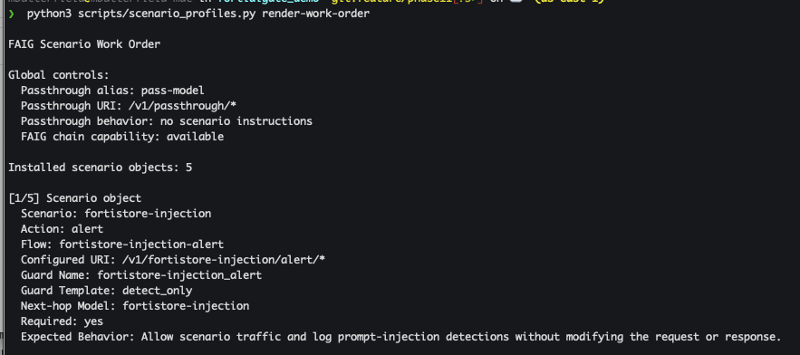
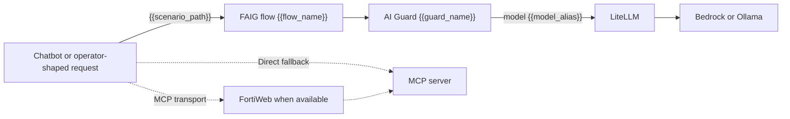
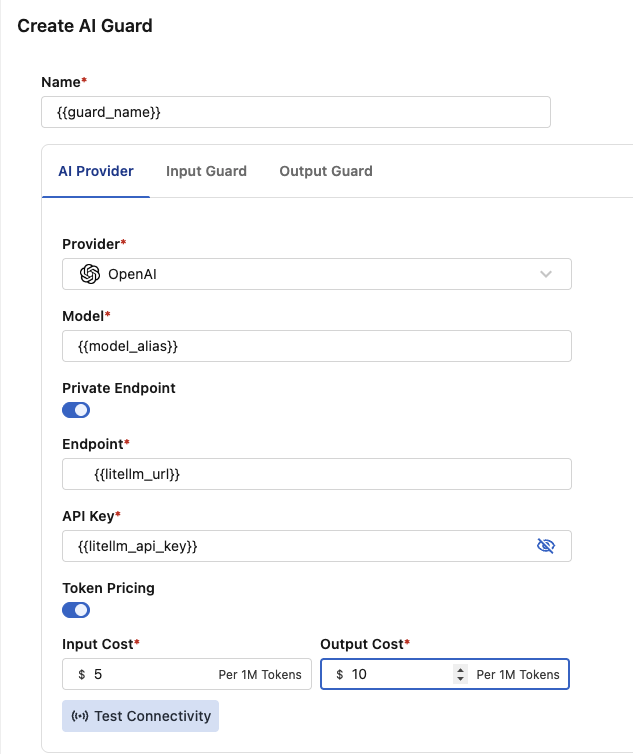
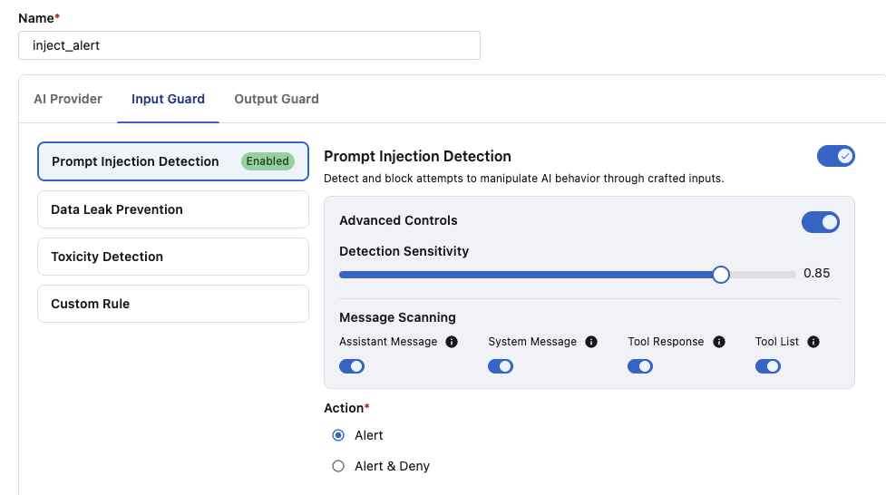
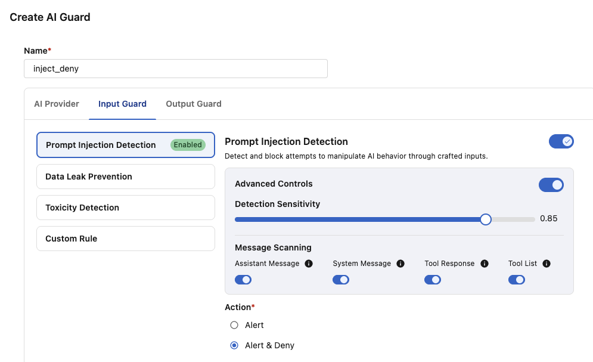
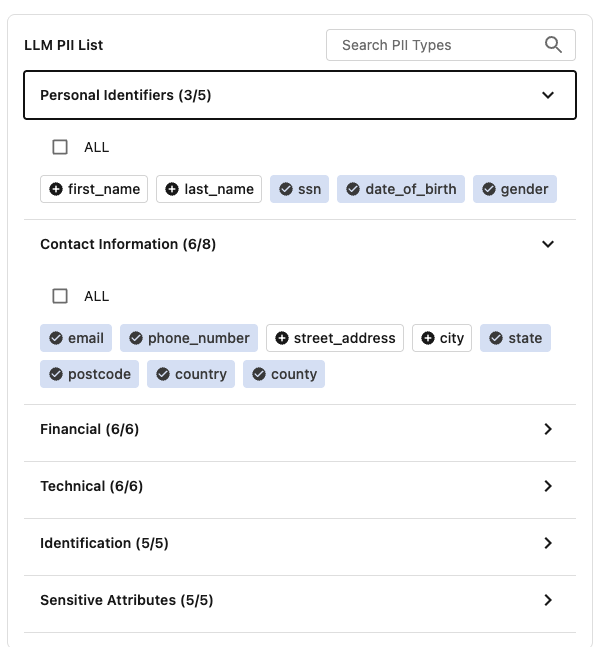
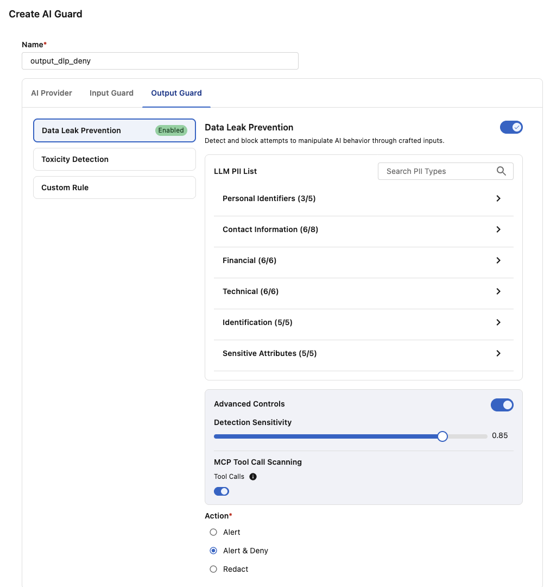
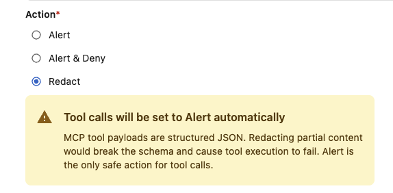
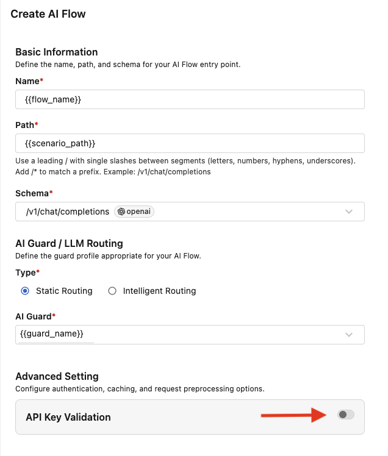
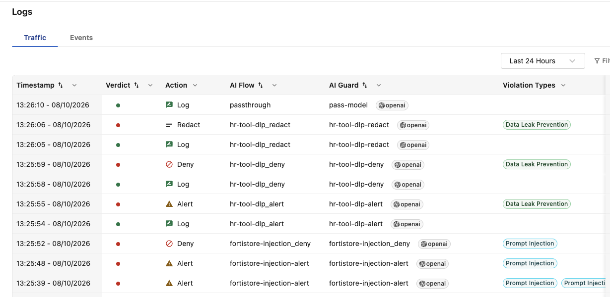

# FortiAIGate Scenario GUI Configuration

This guide turns an installed scenario's generated work order into reusable
FortiAIGate 8.x GUI objects. Complete
[FortiAIGate Initial Configuration](fortiaigate-initial-config.md) first so the
LiteLLM connection values and global passthrough flow already work.

The generated work order is authoritative for names, paths, model aliases, and
Guard Protections. Screenshots use `{{variable}}` values so the same walkthrough
applies to every scenario.

All commands run from `<repo_root>`.

Select the deployed environment in each new shell:

```bash
export FAIG_INVENTORY=cloud
export FAIG_HOST_ALIAS=faig-aws
# or
export FAIG_INVENTORY=local
export FAIG_HOST_ALIAS={{ubuntu-hostname}}
```

For local mode, use the Ubuntu hostname recorded as the host alias by
`local_setup.py`.

## 1. Generate And Read The Work Order

Confirm the scenarios installed in editable local state and render the current
work order:

```bash
python3 scripts/scenario_profiles.py list-installed
python3 scripts/scenario_profiles.py render-work-order
```

The command first prints a terminal-friendly object list. Each numbered entry
uses the exact labels Scenario, Action, Flow Name, Scenario Path, Guard Name,
Guard Protections, Model Alias, LiteLLM URL, LiteLLM API Key, Required, and
Expected Behavior. It then
prints the path to the ignored formatted Markdown version:

```text
Markdown version: docs/raw-output/scenario-work-orders/faig-scenario-work-order.md
```

The terminal output is the normal configuration reference and contains every
value needed for each object. The Markdown file is an optional wider view when
you prefer a table. Re-render after installing, updating, removing, or locally
tuning a scenario.

Map one row at a time:

| Guide variable | Work-order column or value | Example shape |
|---|---|---|
| `{{scenario_id}}` | Scenario | `resume-tool-injection` |
| `{{action}}` | Action | `alert`, `deny`, `redact`, or `chain` |
| `{{flow_name}}` | Flow Name | `{{scenario_id}}-{{action}}` |
| `{{scenario_path}}` | Scenario Path | `/v1/{{scenario_id}}/{{action}}/*` |
| `{{guard_name}}` | Guard Name | `{{scenario_id}}_{{action}}` |
| `{{guard_protections}}` | Guard Protections | The GUI protection recipe to apply to this guard; for example `inject_deny` or `output_dlp_redact` |
| `{{model_alias}}` | Model Alias | Normally `{{scenario_id}}` |
| `{{litellm_url}}` | LiteLLM URL | Resolved endpoint value for the guard |
| `{{litellm_api_key}}` | LiteLLM API Key | Resolved API key for the guard |
| `{{expected_behavior}}` | Expected Behavior | Work-order description |

Guard and flow display names can be changed locally, but the Scenario Path
and next-hop model alias must match the work order. Keeping the suggested names
makes troubleshooting and telemetry correlation substantially easier.



*Map the generated terminal work-order entry into FortiAIGate objects.*

## Request-Path Model



The LLM path and MCP transport are independent. FortiWeb is the preferred MCP
transport when installed, configured, and desired; Direct MCP is the fallback.
Neither transport changes which FAIG flow protects the LLM request or which
scenario tool profile is exposed.

For multi-round MCP scenarios, tool results return to the chatbot as `tool`
messages and are included in the next LLM request. A prompt-injection Deny
guard must inspect those tool-role messages to stop a poisoned document before
the model selects another tool.

## 2. Confirm The LiteLLM Alias

Confirm the scenario model alias is available through LiteLLM before building
the guard:

```bash
ansible-playbook -i "$FAIG_INVENTORY" ansible/playbooks/test_litellm_direct.yml
```

For normal scenario paths `{{model_alias}}` equals `{{scenario_id}}`; do not
substitute the underlying Bedrock or Ollama model ID. LiteLLM owns that final
mapping and instruction injection.

## 3. Create The Scenario Guard

Create one guard for each work-order row:

| Field | Value |
|---|---|
| Guard Name | `{{guard_name}}` |
| Provider | `OpenAI` |
| Model | `{{model_alias}}` |
| Private endpoint | Enabled |
| Endpoint | `{{litellm_url}}` |
| API key | `{{litellm_api_key}}` |
| Token pricing | Enabled |
| Input/output token costs | The same demonstration values used for `pass_model` |

FortiAIGate configures the model connection per guard. Select `OpenAI`, turn on
**Private endpoint**, put the work order's **LiteLLM URL** in the field labeled
**Endpoint**, and put its **LiteLLM API Key** in the API key field. Do not
create or rely on a separate global `litellm` provider object.

Enter input and output token costs for each guard. These values drive only the
FortiAIGate GUI's demonstration cost calculations, so made-up values are fine.
Use a consistent pricing policy across the scenario guards when you want the
dashboard comparison to be meaningful.

Different actions for the same scenario normally share the same model alias.
The guard policy—not a different backend instruction set—creates the Alert,
Deny, or Redact comparison.



*Create `{{guard_name}}`, configure its OpenAI private LiteLLM Endpoint and
display pricing, and select `{{model_alias}}` as its next hop.*

### Test Connectivity

Click **Test Connectivity** before configuring protection. This test checks only the
API key, model alias, endpoint, and connectivity from FortiAIGate to LiteLLM.
It does not exercise the guard's Alert, Deny, or Redact policy and does not
validate a scenario fixture.

Use a short synthetic prompt and correct the connection fields until the model
test succeeds.

The AI Provider screenshot above shows the button location. A successful test
checks the connection only; use the Python functional validator after the flow
exists to prove the guard's Alert, Deny, or Redact behavior.

## 4. Configure Guard Protections

**Guard Protections** is the work-order value that tells you which FortiAIGate
inspection policy to configure on `{{guard_name}}`. It is not a field to enter
on the base guard settings page. Apply the listed recipe after the guard's
LiteLLM connection test succeeds.

Use the recipe that appears in the work order:

| Guard Protections | Protection direction | FortiAIGate configuration |
|---|---|---|
| `inject_alert` | Input | Prompt Injection protection; action **Alert** |
| `inject_deny` | Input | Prompt Injection protection; action **Alert & Deny** |
| `output_dlp_alert` | Output | Output DLP protection and shared PII selection; action **Alert** |
| `output_dlp_deny` | Output | Output DLP protection and shared PII selection; action **Alert & Deny** |
| `output_dlp_redact` | Output | Output DLP protection and shared PII selection; action **Redact** |
| `none` | None | Leave all scenario protections disabled |

Prompt Injection is an **input guard**: it evaluates the transcript being sent
to the model, including selected message roles and retrieved tool results.
Output DLP is an **output guard**: it evaluates the model response before the
response is returned to the chatbot or caller. Configure only the protection
recipe listed for the current work-order row.

### Input Guard: `inject_alert`

Enable prompt-injection inspection, select **Alert**, and allow the request and
response. Do not select Deny. The matching work-order behavior should say the
attack continues while FortiAIGate records the alert.



*Configure `{{guard_name}}` with `inject_alert` to alert without denying.*

### Input Guard: `inject_deny`

Enable prompt-injection inspection for the complete input transcript and set
the action to **Alert & Deny**. For tool scenarios, enable Assistant Message,
System Message, Tool Response, and Tool List scanning so retrieved document
content carried in `tool` messages is inspected. The goal is to stop poisoned
content before the model can follow it or select a prohibited tool.



*Configure `{{guard_name}}` with `inject_deny` to alert and deny the protected
prompt or tool response.*

### Output Guard: Shared DLP PII Selection

Use the same PII selection for `output_dlp_alert`, `output_dlp_deny`, and
`output_dlp_redact`. In the shared demonstration configuration:

- disable `first_name`, `last_name`, `street_address`, and `city`;

- enable `ssn`, `date_of_birth`, `gender`, `email`, `phone_number`, `state`,
  `postcode`, `country`, and `county`; and

- leave every Financial, Technical, Identification, and Sensitive Attributes
  type enabled.

> **Screenshot to add — `faig-scenario-output-dlp-base.png`:** show the base
> Output DLP guard page before opening the PII field list, including the output
> protection toggle and Action control.



*Use the shared PII selection for every output-DLP action; broad name, street,
and city fields are disabled to reduce demo noise.*

### Output Guard: `output_dlp_alert`

Configure the PII fields above and select **Alert**. The response is returned
unchanged while FortiAIGate records the alert.

### Output Guard: `output_dlp_deny`

Configure the PII fields above, leave the shown advanced controls enabled, and
select **Alert & Deny**.



*Configure output DLP to alert and deny responses containing the selected PII
patterns.*

### Output Guard: `output_dlp_redact`

Create this guard exactly like `output_dlp_deny`, including the same PII list
and advanced controls, but change **Action** to **Redact**. The safe remainder
of the response is returned with matching values replaced. FortiAIGate warns
that tool calls remain Alert-only because partially redacting structured tool
payloads could break their schema.



*Copy the output-DLP Deny configuration and change only its action to
Redact.*

The passthrough guard is the exception: its Guard Protections value is `none`,
so no prompt-injection or DLP protection is enabled.

## 5. Create The Scenario Flow

Create the flow after Test Connectivity succeeds and the protection settings are
saved:

| Field | Value |
|---|---|
| Flow Name | `{{flow_name}}` |
| Scenario Path | `{{scenario_path}}` |
| AI Guard | `{{guard_name}}` |
| Client API-key validation | Disabled for the normal isolated lab |

The configured path must end in `/*`. Create specific scenario routes rather
than a generic `/v1/*` fallback.



*Publish `{{scenario_path}}` through `{{guard_name}}` with client API-key
validation disabled for the isolated lab.*

FAIG re-entry is advanced functionality, not part of normal scenario
configuration. Built-in scenarios leave it disabled. Its separate configuration
guide will cover the additional flow, guard, and routing requirements.

## 6. Validate The Active Path

The guard and flow are active when created; there is no separate deployment
step. Validate the configured scenario immediately:

```bash
python3 -m functional_test validate \
  --inventory "$FAIG_INVENTORY" \
  --host-alias "$FAIG_HOST_ALIAS" \
  --scenario-id {{scenario_id}}
```

The validator selects the declared chatbot profile automatically and checks
the configured path's observable behavior, including completion, block or
redaction response, frontend instructions, MCP calls, FortiWeb transport, and
forbidden-tool boundaries as applicable. A successful run ends with
`INSTALLATION READY`; a mismatch exits nonzero with the failed path and
expected result. Confirm the actual appliance action in FortiAIGate Traffic
logs.

Use `python3 -m functional_test render-curl` only for a direct-flow diagnostic.
It does not prove the chatbot agent or MCP server executed the exchange.

## 7. Verify FortiAIGate Telemetry

Use the result from `python3 -m functional_test validate` as the correlation
source. For each case, note its scenario, action, configured path, expected
outcome, and execution time. In FortiAIGate, navigate to **Logs > Traffic**
and locate the corresponding AI Flow, AI Guard, action, and timestamp.



*Use the Python validator result to locate each scenario flow, guard, and
action in FortiAIGate Traffic logs.*

Open the matching row when deeper evidence is needed. Confirm its model alias,
outcome, token usage, displayed cost, and latency agree with the validator and
the expected behavior in the generated work order.

If the path is missing, returns `401`/`404`, selects the wrong guard, or the
model connection differs from Test Connectivity, use
[Troubleshooting](troubleshooting.md#fortiaigate-returns-401-404-or-the-wrong-guard).

Chatbot profile selection and presenter comparisons belong to
[Scenario Management: Select A Chatbot Profile](scenario-management.md#8-select-a-chatbot-profile)
and the individual scenario runbooks, not this administrator configuration
guide.

## Changes After Initial Configuration

Installed scenarios are ignored, editable local state. After an installed
scenario changes:

1. deploy the affected LiteLLM/chatbot configuration;
2. render a new work order;
3. compare it with the deployed FAIG objects;
4. update or recreate the affected guard/flow; and
5. rerun functional validation.

Removing a local scenario does not delete its FAIG GUI objects. Remove or
disable those disposable-lab objects manually after confirming they are no
longer referenced.
