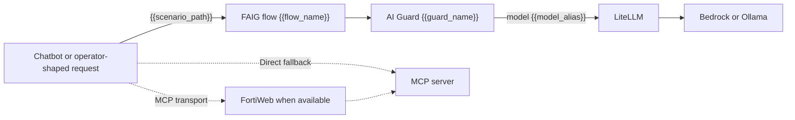

# FortiAIGate Scenario GUI Configuration

This guide turns an installed scenario's generated work order into reusable
FortiAIGate 8.x GUI objects. Complete
[FortiAIGate Initial Configuration](FortiAIGate-initial-config.MD) first so the
LiteLLM connection values and global passthrough flow already work.

The generated work order is authoritative for names, paths, model aliases, and
guard templates. Screenshots use `{{variable}}` values so the same walkthrough
applies to every scenario.

All commands run from `<repo_root>`.

Select the deployed environment in each new shell:

```bash
export FAIG_INVENTORY=cloud
export FAIG_HOST_ALIAS=faig-aws
# or
export FAIG_INVENTORY=local
export FAIG_HOST_ALIAS={{ubuntu-hostname}}
```

For local mode, use the Ubuntu hostname recorded as the host alias by
`local_setup.py`.

## 1. Generate And Read The Work Order

Confirm the scenarios installed in editable local state and render the current
work order:

```bash
python3 scripts/scenario_profiles.py list-installed
python3 scripts/scenario_profiles.py render-work-order
```

The command first prints a terminal-friendly object list. Each numbered entry
uses the exact labels Scenario, Action, Flow, Configured URI, Guard Name,
Guard Template, Next-hop Model, Required, and Expected Behavior. It then
prints the path to the ignored formatted Markdown version:

```text
Markdown version: docs/raw-output/scenario-work-orders/faig-scenario-work-order.md
```

Open the Markdown file when reviewing the complete table. Re-render after
installing, updating, removing, or locally tuning a scenario.

Map one row at a time:

| Guide variable | Work-order column or value | Example shape |
|---|---|---|
| `{{scenario_id}}` | Scenario | `resume-tool-injection` |
| `{{action}}` | Action | `alert`, `deny`, `redact`, or chain-default `detect` |
| `{{flow_name}}` | Flow | `{{scenario_id}}-{{action}}` |
| `{{scenario_path}}` | Configured URI | `/v1/{{scenario_id}}/{{action}}/*` |
| `{{guard_name}}` | Guard Name | `{{scenario_id}}_{{action}}` |
| `{{guard_template}}` | Guard Template | `detect_only`, `protect_input`, `output_dlp_deny`, or `output_dlp_redact` |
| `{{model_alias}}` | Next-hop Model | Normally `{{scenario_id}}` |
| `{{expected_behavior}}` | Expected Behavior | Work-order description |

Guard and flow display names can be changed locally, but the configured URI
and next-hop model alias must match the work order. Keeping the suggested names
makes troubleshooting and telemetry correlation substantially easier.

> **Screenshot placeholder — `faig-scenario-work-order-map`**
>
> Expected filename: `images/fortiaigate/faig-scenario-work-order-map.png`
>
> Caption: Map the generated terminal work-order entry into FortiAIGate objects.
>
> Capture: A tightly cropped terminal work-order entry showing Scenario, Action, Flow, Configured URI, Guard Name, Guard Template, Next-hop Model, and Expected Behavior. Include the final relative `Markdown version:` path; exclude warnings containing addresses and unrelated scenarios.

## Request-Path Model



The LLM path and MCP transport are independent. FortiWeb is the preferred MCP
transport when installed, configured, and desired; Direct MCP is the fallback.
Neither transport changes which FAIG flow protects the LLM request or which
scenario tool profile is exposed.

For multi-round MCP scenarios, tool results return to the chatbot as `tool`
messages and are included in the next LLM request. A prompt-injection Deny
guard must inspect those tool-role messages to stop a poisoned document before
the model selects another tool.

## 2. Confirm The LiteLLM Alias

Confirm the scenario model alias is available through LiteLLM before building
the guard:

```bash
ansible-playbook -i "$FAIG_INVENTORY" ansible/playbooks/test_litellm_direct.yml
```

For normal scenario paths `{{model_alias}}` equals `{{scenario_id}}`; do not
substitute the underlying Bedrock or Ollama model ID. LiteLLM owns that final
mapping and instruction injection.

## 3. Create The Scenario Guard

Create one guard for each work-order row:

| Field | Value |
|---|---|
| Guard name | `{{guard_name}}` |
| Provider | `OpenAI` |
| Model | `{{model_alias}}` |
| Private endpoint | Enabled |
| Endpoint | `{{litellm_url}}` |
| API key | `{{litellm_api_key}}` |
| Token pricing | Enabled |
| Input/output token costs | The same demonstration values used for `pass_model` |
| Protection behavior | `{{guard_template}}` |

FortiAIGate configures the model connection per guard. Select `OpenAI`, turn on
**Private endpoint**, and put the shared LiteLLM URL in the field labeled
**Endpoint**. Use the same ignored LiteLLM provider key configured during
initial setup. Do not create or rely on a separate global `litellm` provider
object.

Enter input and output token costs for each guard. These values drive only the
FortiAIGate GUI's demonstration cost calculations, so made-up values are fine.
Use a consistent pricing policy across the scenario guards when you want the
dashboard comparison to be meaningful.

Different actions for the same scenario normally share the same model alias.
The guard policy—not a different backend instruction set—creates the Alert,
Deny, or Redact comparison.

> **Screenshot placeholder — `faig-scenario-guard-base`**
>
> Expected filename: `images/fortiaigate/faig-scenario-guard-base.png`
>
> Caption: Create `{{guard_name}}`, configure its OpenAI private LiteLLM Endpoint and display pricing, and select `{{model_alias}}` as its next hop.
>
> Capture: The guard page with literal `{{guard_name}}` and `{{model_alias}}` values where free-text fields permit them, OpenAI selected, Private endpoint enabled, `{{litellm_url}}` in Endpoint, and demonstration token costs populated. Keep the LiteLLM key masked.

### Test Model Connectivity

Click **Test Model** before configuring protection. This test checks only the
API key, model alias, endpoint, and connectivity from FortiAIGate to LiteLLM.
It does not exercise the guard's Alert, Deny, or Redact policy and does not
validate a scenario fixture.

Use a short synthetic prompt and correct the connection fields until the model
test succeeds.

> **Screenshot placeholder — `faig-scenario-guard-test`**
>
> Expected filename: `images/fortiaigate/faig-scenario-guard-test.png`
>
> Caption: Confirm the scenario guard's API key, model alias, Endpoint, and connectivity with Test Model.
>
> Capture: A successful Test Model result with `{{guard_name}}` and `{{model_alias}}` visible. Use a short synthetic prompt and omit provider credentials and private endpoints.

## 4. Configure The Protection

### `detect_only`: Alert Without Enforcement

Enable the scenario-relevant prompt-injection or sensitive-data detector,
enable logging/telemetry, and allow the request and response. Do not select
deny, block, or redact. The matching work-order behavior should say the attack
continues while FortiAIGate records the detection.

> **Screenshot placeholder — `faig-scenario-alert-protection`**
>
> Expected filename: `images/fortiaigate/faig-scenario-alert-protection.png`
>
> Caption: Configure `{{guard_name}}` with `{{guard_template}}` to detect and alert without denying.
>
> Capture: The relevant protection page with detection and logging enabled and enforcement disabled. Show the action summary; avoid scenario-specific tuning that will require a different shared screenshot.

### `protect_input`: Deny Prompt Injection

Enable prompt-injection inspection for the complete input transcript and set
the action to deny/block. For tool scenarios, confirm inspection includes
retrieved document content carried in `tool` messages. The goal is to stop the
poisoned content before the model can follow it or select a prohibited tool.

> **Screenshot placeholder — `faig-scenario-deny-protection`**
>
> Expected filename: `images/fortiaigate/faig-scenario-deny-protection.png`
>
> Caption: Configure `{{guard_name}}` to deny the protected prompt or tool response.
>
> Capture: The input prompt-injection protection page showing full-transcript/tool-message inspection when the GUI exposes it and the deny/block action selected.

### `output_dlp_deny`: Deny Sensitive Output

Enable the scenario's required output DLP patterns and set the output action to
deny. Remove or disable `first_name`, `last_name`, `city`, and `state`; those
broad matches create noise in this demo. The scenario work order and runbook
provide the remaining detector settings.

> **Screenshot placeholder — `faig-scenario-output-dlp-deny`**
>
> Expected filename: `images/fortiaigate/faig-scenario-output-dlp-deny.png`
>
> Caption: Configure output DLP to deny responses containing the selected sensitive-data patterns.
>
> Capture: The output DLP page with the scenario-required detectors and deny action visible; show that `first_name`, `last_name`, `city`, and `state` are not selected. Do not include real personal data in test fields.

### `output_dlp_redact`: Redact Sensitive Output

Use the same scenario-required patterns, but select redaction so the safe
remainder of the response is returned. Do not treat input-DLP or the future
`redact-dummy` behavior as part of this output-redaction path.

> **Screenshot placeholder — `faig-scenario-output-dlp-redact`**
>
> Expected filename: `images/fortiaigate/faig-scenario-output-dlp-redact.png`
>
> Caption: Configure output DLP to redact the selected sensitive-data patterns.
>
> Capture: The output DLP page using the same representative patterns as Deny, with redact selected and the replacement behavior visible if configurable.

## 5. Create The Scenario Flow

Create the flow after Test Model succeeds and the protection settings are
saved:

| Field | Value |
|---|---|
| Flow name | `{{flow_name}}` |
| URI | `{{scenario_path}}` |
| AI Guard | `{{guard_name}}` |
| Client API-key validation | Disabled for the normal isolated lab |

The configured path must end in `/*`. Create specific scenario routes rather
than a generic `/v1/*` fallback.

> **Screenshot placeholder — `faig-scenario-flow`**
>
> Expected filename: `images/fortiaigate/faig-scenario-flow.png`
>
> Caption: Publish `{{scenario_path}}` through `{{guard_name}}` to `{{model_alias}}`.
>
> Capture: The flow editor with literal variable values where supported, the complete wildcard URI, attached guard, and disabled client API-key validation.

## 6. Keep FAIG Re-entry Disabled Unless Deliberately Testing It

Every built-in scenario sets `matrix.faig_chain.enabled: false`. Its normal
guard next hop is `{{scenario_id}}`.

> **Screenshot placeholder — `faig-scenario-chain-disabled`**
>
> Expected filename: `images/fortiaigate/faig-scenario-chain-disabled.png`
>
> Caption: Keep FAIG re-entry disabled for the scenario's normal configuration.
>
> Capture: The normal scenario guard summary showing next-hop model `{{scenario_id}}`, with no `-faig-chain` alias selected.

When a locally owned scenario explicitly enables the chain, redeploy LiteLLM
and the chatbot, then re-render the work order. Existing Alert, Deny, and
Redact objects remain unchanged. The matrix adds this dedicated object:

| Field | Generated value |
|---|---|
| Scenario | `{{scenario_id}}` |
| Action | `detect` |
| Flow | `{{scenario_id}}-faig-chain` |
| Configured URI | `/v1/{{scenario_id}}/faig-chain/*` |
| Guard Name | `{{scenario_id}}_faig_chain` |
| Guard Template | `detect_only` |
| Next-hop Model | `{{scenario_id}}-faig-chain` |

Create the dedicated flow and guard from that row. The new flow points to the
new guard, and the guard points to the generated `{{scenario_id}}-faig-chain`
LiteLLM model. That model injects the scenario instructions and re-enters only
through the global `/v1/passthrough/*` flow, which terminates at `pass-model`.
The dedicated guard uses detection without enforcement by default so the
operator can observe the complete re-entry demonstration.

Never point the passthrough guard or the chain's downstream model back to a
`*-faig-chain` alias. That creates a request loop.

> **Screenshot placeholder — `faig-scenario-chain-enabled`**
>
> Expected filename: `images/fortiaigate/faig-scenario-chain-enabled.png`
>
> Caption: Configure the dedicated detect-only flow and guard for a loop-safe FAIG re-entry demonstration.
>
> Capture: The opted-in work-order row and dedicated guard showing `{{scenario_id}}_faig_chain`, `detect_only`, and next-hop model `{{scenario_id}}-faig-chain`. Include the dedicated `/v1/{{scenario_id}}/faig-chain/*` flow or passthrough target proving re-entry terminates at `pass-model`. Use synthetic names and no endpoints.

## 7. Validate The Active Path

The guard and flow are active when created; there is no separate deployment
step. Validate the configured scenario immediately:

```bash
python3 -m functional_test validate \
  --inventory "$FAIG_INVENTORY" \
  --host-alias "$FAIG_HOST_ALIAS" \
  --scenario-id {{scenario_id}}
```

The validator selects the declared chatbot profile automatically and checks
the complete scenario behavior, including Alert, Deny, Redact, frontend
instructions, MCP calls, FortiWeb transport, and forbidden-tool boundaries as
applicable. A successful run ends with `INSTALLATION READY`; a mismatch exits
nonzero with the failed path and expected result.

Use `python3 -m functional_test render-curl` only for a direct-flow diagnostic.
It does not prove the chatbot agent or MCP server executed the exchange.

## 8. Select The Chatbot Profile

In Simplified mode, choose the scenario's named profile. One profile selects
the LLM route, model alias, frontend instructions, MCP transport, scenario tool
profile, and tool-round limit together.

> **Screenshot placeholder — `chatbot-simplified-fortistore-profiles`**
>
> Expected filename: `images/fortiaigate/chatbot-simplified-fortistore-profiles.png`
>
> Caption: Select LLM Direct, Baseline, Alert, or Deny for the FortiStore Injection demonstration.
>
> Capture: The Simplified profile list showing all four canonical FortiStore Injection labels and no compatibility slot names.

> **Screenshot placeholder — `chatbot-simplified-selected-profile`**
>
> Expected filename: `images/fortiaigate/chatbot-simplified-selected-profile.png`
>
> Caption: A Simplified profile selects model, FAIG path, frontend instructions, MCP transport, and tool profile together.
>
> Capture: A selected MCP-enabled scenario profile with its resolved summary visible. Use synthetic endpoint labels and avoid credentials.

Detailed mode permits intentional comparison changes without editing scenario
metadata:

> **Screenshot placeholder — `chatbot-detailed-llm-controls`**
>
> Expected filename: `images/fortiaigate/chatbot-detailed-llm-controls.png`
>
> Caption: Select LLM provider, FAIG route, model alias, and frontend instruction profile independently.
>
> Capture: The Detailed LLM controls with a scenario-owned FAIG route and model alias selected. Include the frontend instruction selector; exclude retired slot names.

> **Screenshot placeholder — `chatbot-detailed-mcp-transport`**
>
> Expected filename: `images/fortiaigate/chatbot-detailed-mcp-transport.png`
>
> Caption: Select FortiWeb MCP by default or Direct MCP as the explicit fallback.
>
> Capture: The Detailed MCP transport selector on an installation where FortiWeb is available. Show FortiWeb selected and Direct as an alternative; omit appliance addresses.

> **Screenshot placeholder — `chatbot-detailed-tool-profile`**
>
> Expected filename: `images/fortiaigate/chatbot-detailed-tool-profile.png`
>
> Caption: Use scenario tools by default or intentionally select the expanded all-installed tool set.
>
> Capture: The Detailed tool-profile selector showing the scenario-scoped profile and `all-installed`. Include the expanded-set warning if the UI displays it.

## 9. Verify FortiAIGate Telemetry

Correlate the functional result with the FortiAIGate event using scenario,
action, request path, flow, guard, model alias, timestamp, detector, outcome,
tokens, cost, and latency.

> **Screenshot placeholder — `faig-scenario-event-detail`**
>
> Expected filename: `images/fortiaigate/faig-scenario-event-detail.png`
>
> Caption: Correlate scenario, action, path, guard, outcome, tokens, cost, and latency.
>
> Capture: One synthetic scenario event detail with those fields visible. Redact authorization headers, private addresses, unique installation identifiers, and any non-synthetic prompt content.

If the path is missing, returns `401`/`404`, selects the wrong guard, or the
model connection differs from Test Model, use
[Troubleshooting](troubleshooting.md#fortiaigate-returns-401-404-or-the-wrong-guard).

## Changes After Initial Configuration

Installed scenarios are ignored, editable local state. After an installed
scenario changes:

1. deploy the affected LiteLLM/chatbot configuration;
2. render a new work order;
3. compare it with the deployed FAIG objects;
4. update or recreate the affected guard/flow; and
5. rerun functional validation.

Removing a local scenario does not delete its FAIG GUI objects. Remove or
disable those disposable-lab objects manually after confirming they are no
longer referenced.
