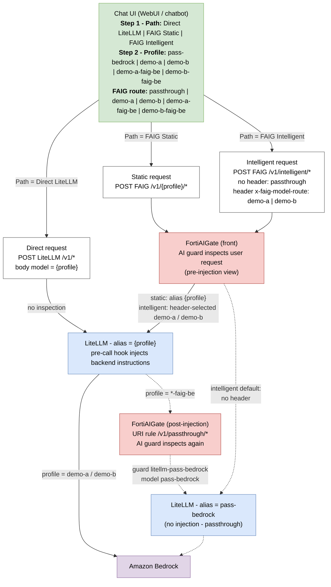

# FortiAIGate Demo Lab - LLM Request Flow

Path picks the transport/endpoint; Profile picks the LiteLLM alias. All profiles
end at the same Bedrock target - the selection only changes URL, header, and
model-name construction, and therefore what FAIG inspects.

Notes:

- Direct LiteLLM: model name in request body, FAIG never sees the request.
- FAIG Static: profile encoded in the URI path (`/v1/{profile}/*`).
- FAIG Intelligent: single URI `/v1/intelligent/*`; no route header uses
  `passthrough`, which maps to LiteLLM alias `pass-bedrock`; the
  `x-faig-model-route` header selects `demo-a` or `demo-b`.
  `*-faig-be` profiles apply to the static path.
- Dashed path applies only when profile = `*-faig-be`: LiteLLM injects
  instructions, then chains through FAIG `/v1/passthrough/*` so the guard sees
  the post-injection request. `/v1/passthrough/*` maps to `pass-bedrock` through
  the `litellm-pass-bedrock` guard/provider (never a `*-faig-be` alias, or the
  request loops).
- FAIG is reached via the in-cluster nginx ingress service; LiteLLM appends
  `/chat/completions` to configured base paths.
