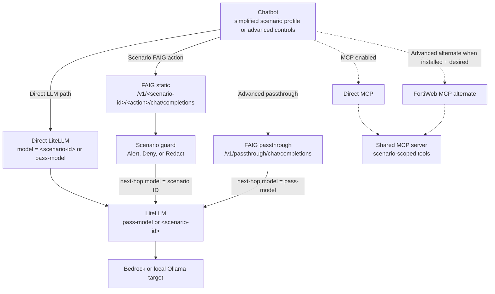

# FortiAIGate Demo Lab Request Flows

Phase 11 separates the scenario from the action. The scenario chooses the
LiteLLM alias and protection story; the action chooses the FortiAIGate guard
disposition.

```mermaid
flowchart TD
    UI["Chatbot<br/>simplified scenario profile or advanced controls"]
    DIRECT["Direct LiteLLM<br/>model = &lt;scenario-id&gt; or pass-model"]
    STATIC["FAIG static<br/>/v1/&lt;scenario-id&gt;/&lt;action&gt;/chat/completions"]
    PASS["FAIG passthrough<br/>/v1/passthrough/chat/completions"]
    GUARD["Scenario guard<br/>Alert, Deny, or Redact"]
    LL["LiteLLM<br/>pass-model or &lt;scenario-id&gt;"]
    MODEL["Bedrock or local Ollama target"]
    MCPD["Direct MCP"]
    FWEB["FortiWeb MCP alternate"]
    MCP["Shared MCP server<br/>scenario-scoped tools"]

    UI -->|"Direct LLM path"| DIRECT
    UI -->|"Scenario FAIG action"| STATIC
    UI -->|"Advanced passthrough"| PASS
    DIRECT --> LL
    STATIC --> GUARD
    GUARD -->|"next-hop model = scenario ID"| LL
    PASS -->|"next-hop model = pass-model"| LL
    LL --> MODEL
    UI -.->|"MCP enabled"| MCPD
    UI -.->|"Advanced alternate when installed + desired"| FWEB
    MCPD -.-> MCP
    FWEB -.-> MCP
```

Key rules:

- `pass-model` and `/v1/passthrough` bypass scenario instruction injection.
- Each installed scenario has one LiteLLM alias matching its scenario ID.
- All FAIG actions for a scenario use that same alias as their guard next hop.
- Direct MCP is the normal scenario choice. FortiWeb is an optional advanced
  alternate and does not multiply simplified profiles.
- FortiGate LLM proxy routes, intelligent header routing, and FAIG re-entry
  chains are disabled in the Phase 11 baseline.
- Installed local scenarios and the generated work order are the runtime source
  of truth; tracked examples are templates.

See [FortiAIGate Scenario Flow Configuration](FortiAIGate-initial-config.MD)
for the reusable GUI walkthrough and [Scenario Runbook](scenarios.md) for
scenario-specific test commands.
