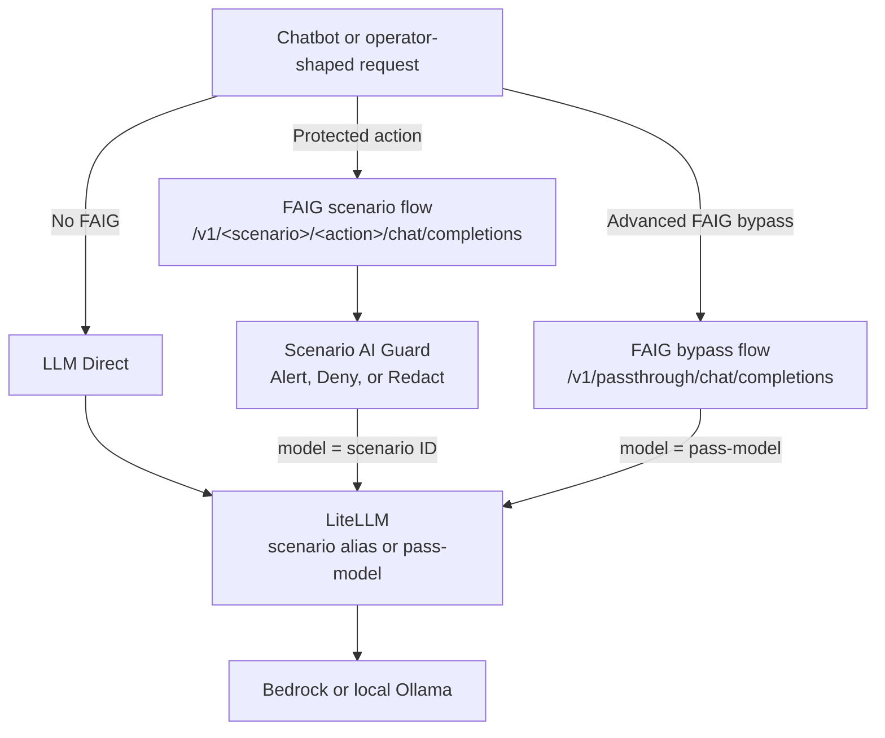
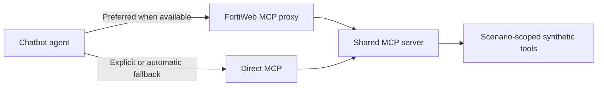
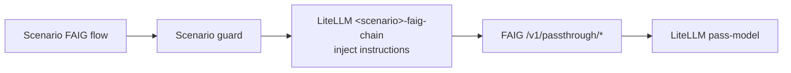

# FortiAIGate Demo Request Flows

This page is the compact orientation for the lab's LLM and MCP request paths.
Use [Initial Configuration](FortiAIGate-initial-config.MD) to create
passthrough and [Scenario GUI Configuration](fortiaigate-gui-config.md) for
scenario-owned FAIG objects.

## LLM Paths


```mermaid
flowchart TD
    UI["Chatbot or operator-shaped request"]
    DIRECT["LLM Direct"]
    FLOW["FAIG scenario flow<br/>/v1/&lt;scenario&gt;/&lt;action&gt;/chat/completions"]
    PASS["FAIG bypass flow<br/>/v1/passthrough/chat/completions"]
    GUARD["Scenario AI Guard<br/>Alert, Deny, or Redact"]
    LL["LiteLLM<br/>scenario alias or pass-model"]
    MODEL["Bedrock or local Ollama"]

    UI -->|"No FAIG"| DIRECT
    UI -->|"Protected action"| FLOW
    UI -->|"Advanced FAIG bypass"| PASS
    DIRECT --> LL
    FLOW --> GUARD
    GUARD -->|"model = scenario ID"| LL
    PASS -->|"model = pass-model"| LL
    LL --> MODEL
```

| Path | Purpose |
|---|---|
| LLM Direct | Chatbot sends directly to LiteLLM; FAIG does not inspect the request |
| Scenario FAIG flow | FAIG applies the scenario's Alert, Deny, or Redact guard, then uses the scenario ID as the LiteLLM alias |
| FAIG bypass | Request traverses FAIG through `/v1/passthrough/*`, but the `pass_model` guard adds no scenario protection and LiteLLM uses `pass-model` without scenario instructions |

Canonical scenario configuration:

- path: `/v1/<scenario>/<action>/*`;
- request URL: `/v1/<scenario>/<action>/chat/completions`;
- flow: `<scenario>-<action>`;
- guard: `<scenario>_<action>`; and
- next-hop LiteLLM model: `<scenario>`.

The exact installed values come from:

```bash
python3 scripts/scenario_profiles.py render-work-order
```

## MCP Transport Is Independent


```mermaid
flowchart LR
    UI["Chatbot agent"] -->|"Preferred when available"| FW["FortiWeb MCP proxy"]
    UI -->|"Explicit or automatic fallback"| DIRECT["Direct MCP"]
    FW --> MCP["Shared MCP server"]
    DIRECT --> MCP
    MCP --> TOOLS["Scenario-scoped synthetic tools"]
```

FortiWeb is the default MCP transport only when it is installed, configured,
desired, and usable. Direct MCP is the fallback. Changing MCP transport does
not change the FAIG LLM flow or expand the selected tool profile.

Tool results become `tool` messages in later LLM requests. That is why a
scenario can use FortiWeb for MCP transport while FortiAIGate independently
inspects the returned tool content on the LLM path.

## Optional FAIG Re-entry

FAIG re-entry is globally available but disabled by every built-in scenario.
An explicitly opted-in local scenario uses this loop-safe path:


```mermaid
flowchart LR
    FLOW["Scenario FAIG flow"] --> GUARD["Scenario guard"]
    GUARD --> CHAIN["LiteLLM &lt;scenario&gt;-faig-chain<br/>inject instructions"]
    CHAIN --> PASS["FAIG /v1/passthrough/*"]
    PASS --> MODEL["LiteLLM pass-model"]
```

The re-entry must terminate at `pass-model`. Never route passthrough back to a
`*-faig-chain` alias. FortiGate LLM proxy paths and appliance-fronted FAIG
chains are not part of the supported baseline.

## Source Of Truth

- Installed local scenario metadata owns the active matrix.
- The generated work order owns FAIG paths, guards, templates, and aliases.
- Tracked scenario examples are read-only sources.
- [Functional validation](functional-validation.md) proves the deployed
  chatbot/MCP/FAIG behavior after GUI objects exist.
