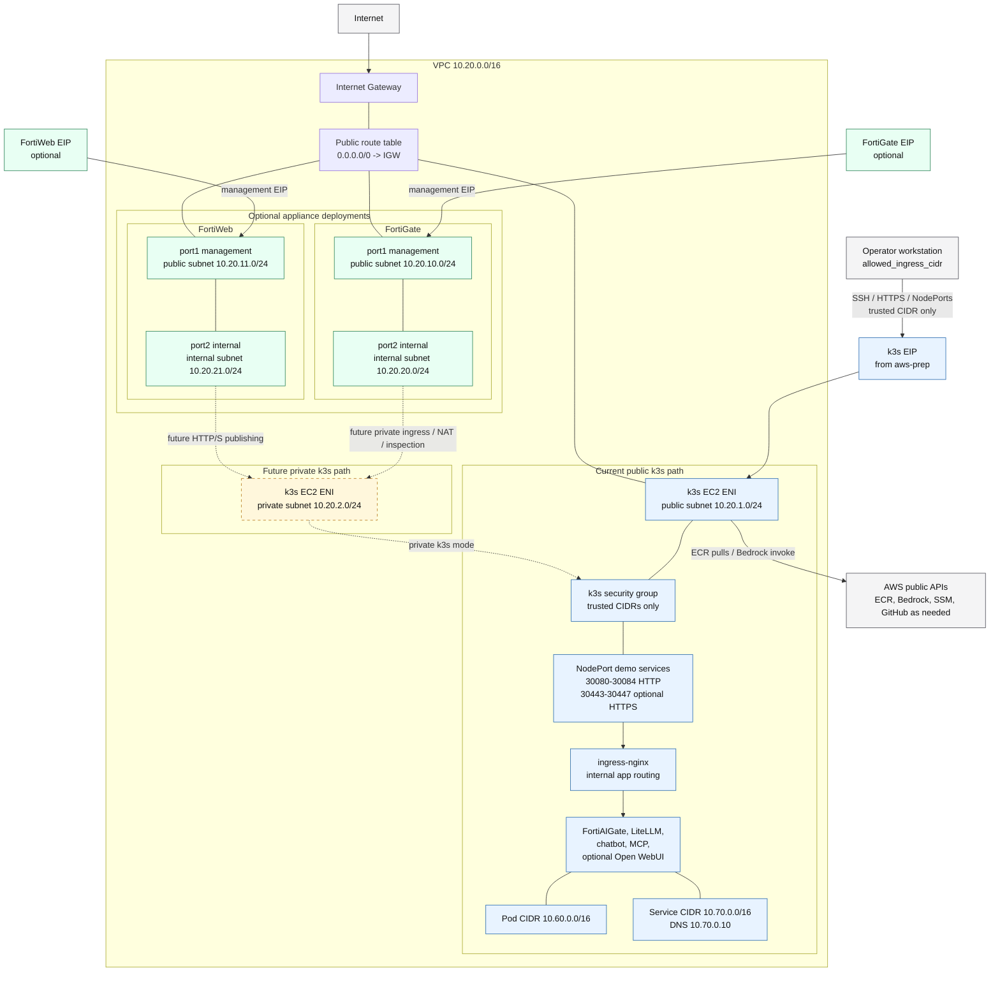
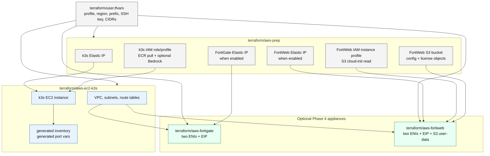

# VPC Layout

These diagrams separate the AWS network layout created by
`terraform/aws-ec2-k3s` from the supporting resources prepared by
`terraform/aws-prep`. Keeping prep resources out of the VPC drawing makes the
network diagram easier to read.

The default deployment mode is `k3s_subnet_mode = "public"`:

- the k3s EC2 host is placed in the k3s public subnet
- the host receives the prep-owned k3s Elastic IP
- SSH, HTTP, HTTPS, and demo NodePorts are allowed only from
  `allowed_ingress_cidr`
- the instance does not request an auto-assigned ephemeral public IP

FortiGate and FortiWeb are optional appliance deployments with public
management EIPs and internal ENIs. Private k3s mode and appliance-fronted
traffic paths remain planned expansion paths.

## VPC Network Topology

## Prep Resources And Module Dependencies

## Routing Notes

| Mode | k3s placement | Public access | Default route |
|---|---|---|---|
| `public` | k3s public subnet | k3s Elastic IP from AWS Prep | public route table to IGW |
| `private` | k3s private subnet | future FortiGate/FortiWeb path | future appliance/NAT path |

Current public mode is intentionally simple for repeatable demos. Private mode
should be used only after a management path and appliance-fronted ingress path
are in place.

## Related Values

| Value | Default |
|---|---|
| VPC CIDR | `10.20.0.0/16` |
| k3s public subnet | `10.20.1.0/24` |
| k3s private subnet | `10.20.2.0/24` |
| FortiGate public subnet | `10.20.10.0/24` |
| FortiWeb public subnet | `10.20.11.0/24` |
| FortiGate internal subnet | `10.20.20.0/24` |
| FortiWeb internal subnet | `10.20.21.0/24` |
| k3s pod CIDR | `10.60.0.0/16` |
| k3s service CIDR | `10.70.0.0/16` |
| k3s DNS | `10.70.0.10` |

Keep AWS VPC, k3s pod, and k3s service networks non-overlapping. Change these
values before cluster creation; changing k3s cluster networks after deployment
requires a rebuild.
